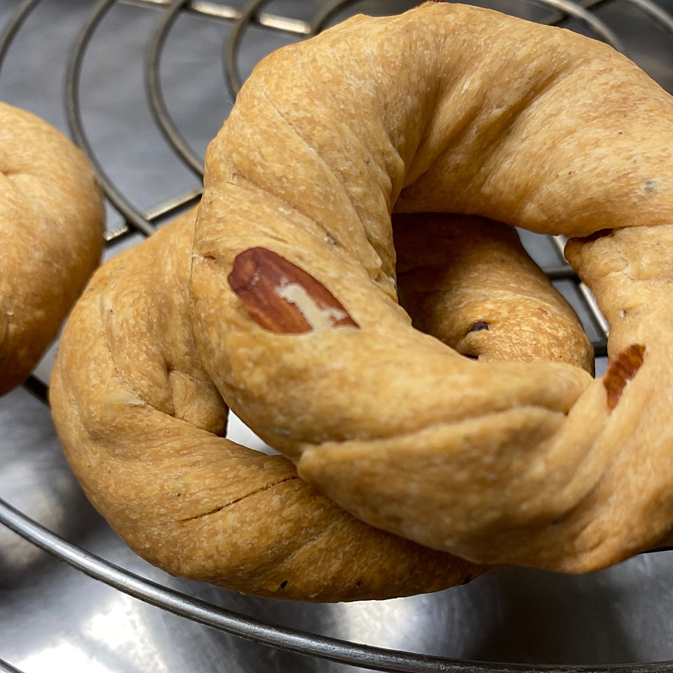

A couple of summers ago, we arrived on Ischia in that dead time, too late for lunch, too early for an aperitivo, and famished. The *tavola calda* just down the road didn’t have much left, but we took some of what there was and then I noticed on the counter a jar of large circular things, with almonds. Presuming them to be some kind of *ciambelle*, I confidently ordered two of them as a nod towards dessert.

===

{.center}

When we came to eat them, we were suprised, very pleasantly so, to find them intensely savoury, very short and crumbly with a good hit of pepper. We had discovered neapolitan taralli, or salty ring cookies, as the Washington Post helpfully explained. I did a bit of online searching, and determined that the best of them featured lard as the essential shortening. Filed them away in the back of my mind as yet another good thing that needs lard, and thought about them only occasionally, except when in Naples or on Ischia.

Then, a little more than a month ago, [@domenicacooks](https://www.instagram.com/domenicacooks/) posted a photo and — better still — a recipe, and I had bought some lard to make dumplings for a chicken stew. So, yesterday, I had a go at [Domenica’s recipe for Taralli Sugna e Pepe](https://www.domenicacooks.com/blog/taralli-sugna-e-pepe).

*Sugna*, as Domenica explains, is leaf lard, which is the very highest quality pig fat. I had only a plastic tub of *strutto* from the supermarket, but it was entirely good enough. I won’t duplicate the recipe here, as Domenica deserves all the credit and the traffic. Just looking at the photos, her *taralli* seem to have risen more than mine, and given that this is a yeasted dough, I do wonder whether there ought to have been a second rise after shaping the rings.

{.center}

No matter; they were absolutely terrific. Rich, short, zesty and delicious. I’m sure I will make them again.

!!! Syndicated to <a href="https://www.fornacalia.com/2020/neapolitan-taralli/" class="u-syndication">Fornacalia</a>.
