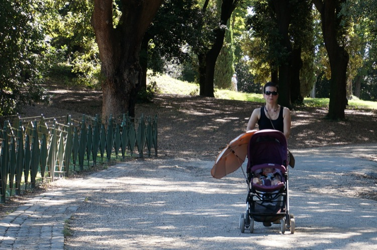

 
Modern digital cameras are so capable that just about anything you want to do, you can do. You just have to figure out how. When my friend David showed me how to change the output of the flash on my venerable Canon G7 I was astonished. 

"So I can get decent fill flash?"

"Of course you can. Why wouldn't you?"

"Because I hadn't read the manual."

And now I have a whole new and much more complicated manual not to read. I went and sprung for a Sony NEX-6, with a couple of lenses, mostly because [a guy whose opinions I really respect liked it](http://theonlinephotographer.typepad.com/the_online_photographer/2013/04/sony-nex-6-review-conclusion-part-ii.html). Also because the Best Buy I visited didn't actually stock any of the other mirrorless cameras I had contemplated.

Before I'd taken even a single image some pluses and minuses became obvious. Minus: there's no external charger in the box. Plus: it feels really good in the hand, with more of a grip than the G7. But that doesn't count, so this morning I took it out for a spin while walking the dog, just letting it do it's thing. I made one decision. The camera boasts two fully automatic modes, Intelligent Auto [^1]  and Superior Auto [^2] and I chose Superior Auto. [^3] And then I just pointed and shot, and another plus came into being: I really like the electronic viewfinder. It is really nice to lift the camera to my eye and look around.

Anyway, here are some sample images, none selected for artistic merit. [^4]

{.center}

The first shot. Seems OK at this size, but a bit of pixel peeping -- the next image is at 100% -- reveals that the supposed subject is not sharp. It also reveals a funny blue fringe around the white of the man's shirt.

{.center}

I can't imagine this being a problem at normal image sizes.

{.center}

{.center}

These two are at the two extremes of the shorter lens, 16 mm and 50 mm. And the next two are at the two extremes of the longer lens, 55 mm and 210 mm.

{.center}

{.center}

Auto-focus is definitely a little dodgy, possibly because I wasn't really giving the camera a chance. So as the next two images show, it sometimes focuses somewhere other than where I expected it to. [^5]

{.center}

{.center}

On the other hand, when given less choice in the matter, Superior Auto is quite capable of beautiful auto-focus, even at full extension of the longer lens.

{.center}

{.center}

Overall, I have to say I'm rather happy. There's still an awful lot to learn, but the camera does feel right. I should add that all the images are JPEGs straight out of the camera. It does shoot RAW files, and I'm looking forward to seeing how those stack up, but to do that I need to move on from iView Media Pro as my image manager. Suggestions welcome.

[^1]: "The camera evaluates the subject and makes the proper settings"

[^2]: "Shoots images with a wider range of shooting functions than those of Intelligent Auto shooting. Recognizes and evaluates the shooting conditions automatically, performs Auto HDR, and chooses the best image."

[^3]: And obviously I did read the manual.

[^4]: None captioned, either; that's something else I need to figure out with Octopress.

[^5]: Actually, at this reduced size, you can't really see the problem. Focus on the top shot, which I thought would be the boys, is the background, while focus on the next, which Ithought would be the background, is the people in foreground.