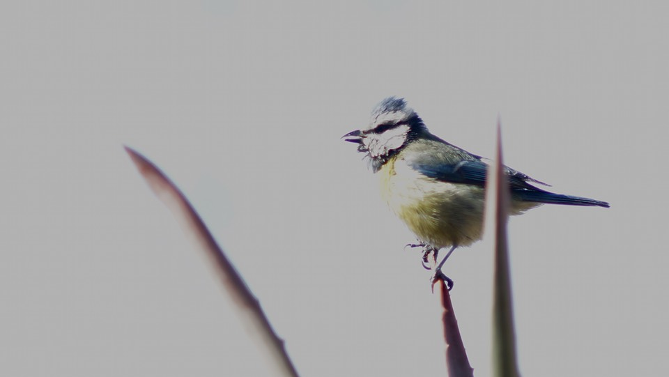
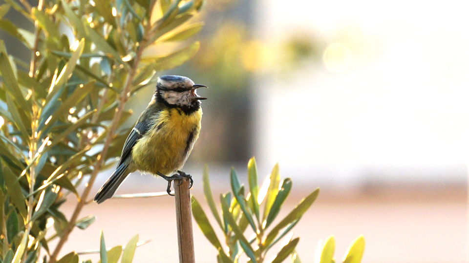

A couple of weeks ago The Main Squeeze said she had seen some little birds poking around the entrance to a somewhat strange hollow terracotta sculpture we have on the terrace. Sure enough, I confirmed the presence of blue tits. There’s no sign yet of any activity within the sculpture, but the birds have become more obvious and, dare I say it, less afraid. I’ve even been able to sit out on the the terrace with both the Minolta Rokkor 135 mm and the Sony 55-210 mm equivalent zoom on my Nex-6 and get some halfway decent images. Here’s one with the Rokkor:

[{.center}](blue-tit-2-1920.jpeg)

The background is a very dull sky, which worked out well.

And here, a couple of days later, is one with the Sony:

[{.center}](blue-tit-1920.jpeg)

The nice thing about using the proper camera for this sort of thing is that it offers enough pixels to be able to crop out a respectable sized detail from an unremarkable frame.
