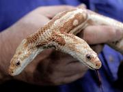

Communicatrix may be breaking new ground in the what-to-blog-if-you’ve-nothing-to-blog-about realm. Not content with that old standby of blogging the search terms people have used to find you (as I am) she’s sharing the [sites she has Stumbled Upon](https://web.archive.org/web/20070423104206/http://www.communicatrix.com:80/2006/08/stumbleupon.html) using the fine Firefox extension of that name. Of course she has a reason:

> A part of my work, I'm starting to realize, involves copious amounts of play. I get stuck otherwise, in the same books, the same thoughts, the same intake. And since I cannot expect to do anything differently by doing everything the same, Stumble Upon is a great way to change things up, open things up, shake things up.

That makes it work, right?

I've been Stumbling for a while now, but in my case it is pure play, a treat I dangle myself to get through an hour of work-related stupefaction.  Beats looking for girl's privets.

{.left} Something I did stumble upon (note the careful use of lower case there) is the St. Louis World Aquarium's attempt to stage a world-record breaking exhibit of two-headed animals. Better yet, officials at the zoo are hoping they can persuade a couple of the snakes to make the beast with eight eyes.

!!! _2021-08-17:_ OK, none of the original links in that final paragraph have survived, but I couldn’t leave it at that. The exhibit did take place and remains the record holder for [largest exhibit of two-headed animals](https://www.guinnessworldrecords.com/world-records/largest-exhibit-of-two-headed-animals) in the world. Alas, that wasn’t enough to secure the future of The World Aquarium,  [which is no more](https://en.wikipedia.org/wiki/World_Aquarium). But perhaps it was a fitting end for We, the two-headed snake that seems to have prompted these dreams of glory, who [died the following year](https://en.wikinews.org/wiki/We,_the_two-headed_snake,_dies_in_U.S._museum_at_age_8). 
