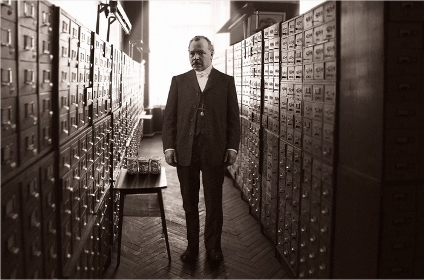
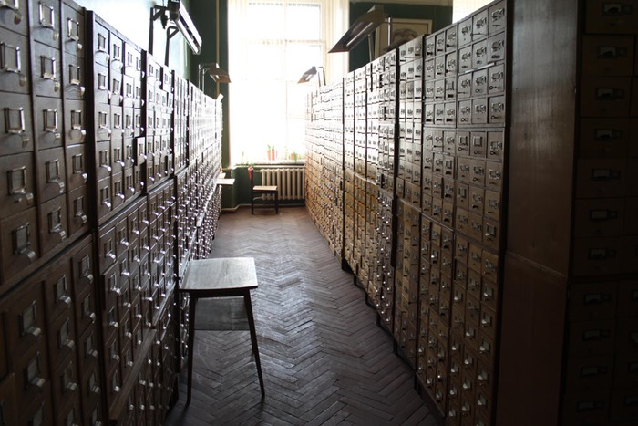
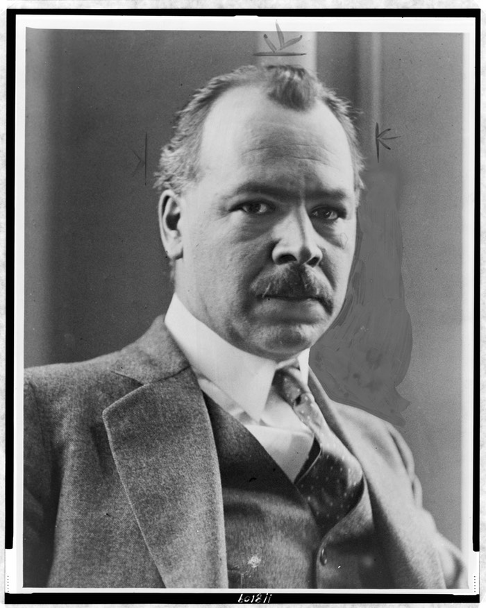

[A Blight on Soviet Science](https://www.damninteresting.com/a-blight-on-soviet-science/) is a recently published long read about Nikolai Vavilov. It’s a good read too, a well-told account of the life of the extraordinary botanist and seed collector, his fight with Trofim Lysenko and eventual downfall and death in prison of starvation. Just one thing about it worried me.

The picture at the top of the article.

===

[{.center}](fake-vavilov-1221.jpg)

It just isn’t right. There is definitely something of the uncanny about it. Vavilov’s head, for example, is certainly him, but it doesn’t quite sit right on his neck or shoulders. More than that, while I am no expert on Vavilov, I have taken a keen interest in him for a long time and I am sure I would have known and recognised an image of him, especially one apparently among the seed-filled drawers of the Institute of Applied Botany in St Petersburg.

As a first step, because there might just be such an image of which I was ignorant, I asked [tineye.com](https://tineye.com/) if it could find anything similar. The result was a shock: an almost identical image from which both Vavilov and the jars had vanished, as if airbushed out by the skilled hands of an expert Soviet censor.

[{.center}](kosina-1400.jpg)

That image was taken on 3 June 2010 by Petr Kosina, a wheat breeder then at the International Center for the Improvement of Wheat and Maize, who was visiting the N.I. Vavilov Institute in St Petersburg during the 8th International Wheat Conference. His caption suggests that it shows the card catalogue of the library, rather than drawers for seed storage.

Encouraged, I looked through my books on Vavilov to see if I could identify the portrait. I knew I had seen one very like it. And I had, the only picture of Vavilov available online from the [Library of Congress](https://www.loc.gov/item/97513426/). 

[{.center}](vavilov-portrait-1400.jpg)

It is from the New York World-Telegram & Sun. The photo is dated 1933, but I wonder whether it might have been taken in October 1932, while Vavilov was taking part in the 6th International Genetics Congress at Cornell University in Ithaca, NY.

Although he is facing the other way, this is quite definitely the same face as in the mystery image. I had the background, I had the portrait, time to play forensic image-wallah. I resized the background photo, put it on top of the mystery image, and tweaked its opacity back and forth. The fit was almost perfect, although perhaps the mystery image had been slightly corrected for parallax.

Then I flipped the portrait horizontally, adjusted its size to fit, and did the same. Again, the overlap was essentially perfect. I made a little movie to show the effect.

{.center}

At this point, I did not bother to go looking for either the body, which might be Vavilov, though I doubt it, or the three jars of seeds cunningly placed on the little table.[^1] Nor am I, here, going to enumerate the other clues all pointing to the same conclusion. The mystery image is a fake, and not a very good one.

**The bigger mystery is: why?**

The article, at its core, is about how Lysenko’s fake science, intended to demonstrate the superiority of Marxist theory, was responsible for the death by starvation not only of Nikolai Vavilov but also of uncountable millions of Russians. 

**Does a photo faked to show Vavilov in the card index of a library not undermine that intent?** [^2] 

[^1]: If I were a better forensic image analyst, I’d probably be able to calculate the plane of the lids and compare it with the plane of the table, but the result wouldn’t add much.

[^2]: There are, of course, a fair number of photographs of Vavilov on his collecting expeditions and with some of the hugely important specimens he brought back, any one of which would have been a much more fitting tribute.
