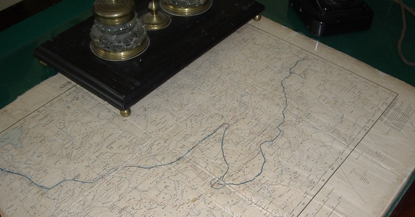

{.center}

This short episode fails to do justice to the man who, more than anyone, first grasped the importance of knowing where and how wheat arose. It does, however, explain why Vavilov wanted to collect the building material of future food security, for wheat and many other crops. In more than 60 countries, Vavilov and his colleagues gathered diversity from farmers’ fields; they died protecting their collections.

Thanks to Luigi Guarino for the photograph of Vavilov’s desk with his route across Ethiopia, and much else besides.

<a href="https://www.eatthispodcast.com/our-daily-bread-08/" rel=canonical>Listen to Nikolay Ivanovich Vavilov at Eat This Podcast.</a>