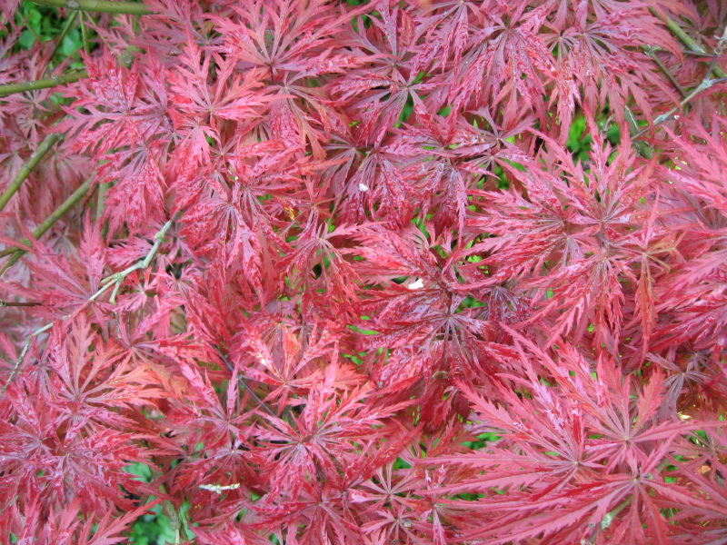

{.center}

Belatedly getting round to posting some pictures from Ninfa earlier this spring. There’s not a lot one can say about the gardens without seeming like a total milquetoast. They’re romantic, they’re overgrown, they’re bursting with plants and full of ruins, they’re suggestive, they’re breath-taking. But rather like, say, the Sistine chapel, I think I’d be prepared to pay good money to be allowed to wander through Ninfa unshepherded by a guide. A friend of The Squeeze knows the family, but as yet has not come through with the goods.

I took the opportunity to stick all the images in [one big set](https://www.flickr.com/photos/jcherfas/sets/72157606111263937/).

