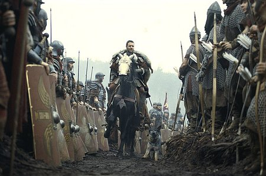

{.center}

[Rebecca](http://rebeccablood.net/) pointed to an excellent essay on [The Merits of Nitpicking: A Doctor Diagnoses House](http://www.henryjenkins.org/2007/01/the_merits_of_knitpicking_a_do.html) by Henry Jenkins. The basic riff is that popular culture provides a way in for people to get involved in obscure subjects. Jenkins wonders:

> how we can incorporate something like the nitpicking process into the educational system. What is the value of getting students to apply their knowledge to deconstruct a popular representation? What is gained by the process of walking through such critiques and then trying to verify competing truth claims through reference to concrete evidence and information?

The post struck a deeply resonant chord, for two reasons.

One, I’m not above a little nit-picking myself. I barely suppressed a snort of derision when early in the movie Gladiator Crowe trailed his hand through that field of wheat. It was way too dwarf, and way too uniform. Likewise the strawberries in one of the films of one of Jane Austen's novels. Gross modern strawberries, not at all the delicate perfumed woodland strawberries they should have been.[^fn1]

Two, I used to use a similar technique myself, back in the day when I taught undergraduate biology. The big problem was to work out, as quickly as possible, how well students understood natural selection. Even then, many schools in the UK tiptoed around the subject. Students learned the Krebs cycle in all its intricate glory, but were not necessarily at ease with the mechanism that created all that intricacy. So the first essay I asked them to write was generally a criticism of a wonderful article called, as I recall, “Do I have to believe in evolution?”. The central plank in the article was that old chestnut about complexity. In this case (probably because it predates [Fred Hoyle’s 747](https://web.archive.org/web/20000816072638/http://home.wxs.nl/~gkorthof/kortho46a.htm)) the question, as best I recall it was: ”what are the odds that a man throwing rocks at a car would adjust the carburetor to make the engine run more smoothly?” And there was a wonderful cartoon of a man gazing at a completely wrecked car -- smashed windscreen, dented bodywork, flat tires, the whole thing -- scratching his head in bewilderment, rocks littering the ground.

Some students couldn’t see the point. That’s just wrong, they’d say, and I do believe in evolution, so why should I have to critique it? Their privilege, of course, but I insisted and not all of them wrote the essay they ought to have been able to. Others went meekly away and came back saying they couldn’t find anything wrong with the article, and no, they didn’t have to believe in evolution. We had our work cut out, but we usually made it. And one or two went to town on the idea, having as much fun as possible. They had their work cut out too, but in the best possible way.

These recollections are not much more than nostalgia, not least because I am not really imbibing a whole lot of popular culture at the moment. [Doomwatch](https://en.wikipedia.org/wiki/Doomwatch) and [The Expert](https://www.imdb.com/title/tt0159163/), those were TV programmes I, at least, could get my teeth into, and not just because I had more teeth back then. It does strike me that while Jenkins’ proposal still makes a lot of sense for some subjects -- medicine, forensics, physics -- there doesn’t seem to be a whole lot of scope for straightforward biology. X files was such tosh that there wasn’t even anything worth getting to grips with. Is there anything else out there?

[^fn1]: Of course, I remember the strawberries better than which film of which novel -- I want to say Persuasion.  I could, of course, poke fun at the stirrups in the photo I did choose (© 2000 Dreamworks Pictures, found [here](https://web.archive.org/web/20100520070454/http://www.movieweb.com:80/movie/gladiator-2000)), but that's a skill best left to French & Saunders. And of course I am available for consultancy work, should any movie require horticultural accuracy of any sort.
