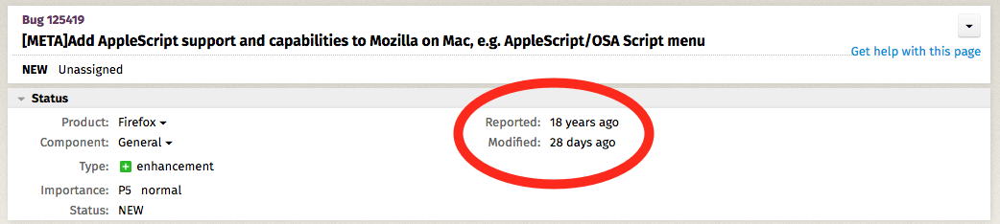

 
I can't remember when I switched my everyday browser from Safari to Firefox. Quite a while ago now. But I'm seriously thinking of switching back to Safari for one reason only: automation.

===

{.center}
_Eighteen years, and counting._

The main reason I am in a browser most of the time is research. When I come across something that might be valuable, I want to save the details, either in Pinboard or else as a link in whatever I am writing. Pinboard requires a click or two no matter what browser I am using. Creating a proper Markdown-formatted link is much easier from Safari precisely because it can be controlled with Applescript, and Applescript can be invoked with Text Expander. 

Firefox has an excellent extension that creates good Markdown links but it requires leaving wherever I am writing to click on the extension, select what I want it to do, go back and paste the result. I've put up with it for a while, because one of the best things Firefox has going for it (for me) is that it works with Omnibear, which allows me to make use of Micropub to add things to my own website. I hate to give that up, but the fact is that there are alternatives that will work in Safari. The trade-off may be worth it.
