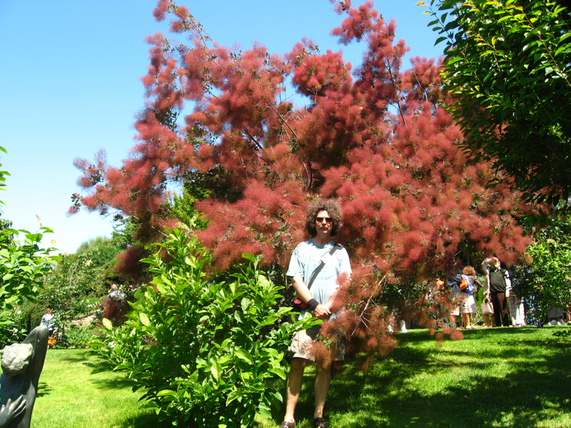

{.center}

On a glorious Sunday, what could be nicer than visiting some gardens? Alas, they don’t quite know how to organize these things in Italy. No scones, no home-made jam, no plants for sale (which is just as well as I have nowhere to put them). But they do have guides, and regimentation. Parties enter on the hour, give or take, and only in parties. No straying. And the guides are nothing if not loquacious. In an area known for bare patches on the hillsides, we were informed that this was the result of “erosion, which could be said to have been caused by atmospheric precipitation, and in particular the type one can call rain”.

But that’s just me talking for the sake of it. In fact this was a wonderful tour of some private gardens that are very seldom open. And if some weren’t quite to my taste, no matter. I do wonder, though, why one would have a wonderful gazebo fully 500 metres from the house. And without that wonderful a view. Could it really be worth strolling up there with a tea-tray?

Strenuous efforts were made to map the proceedings, followed by astonishingly boring efforts to get them all into flickr, and thence into a Google Earth file. (There must be an easier way.) Now, I’m not sure how to share these things. I have the requisite KML file. But how do I put it here so that all can sneer at my geekiness? Maybe you would prefer to just go and have a [look at the photos](https://www.flickr.com/photos/jcherfas/sets/72157600241054410/)?

