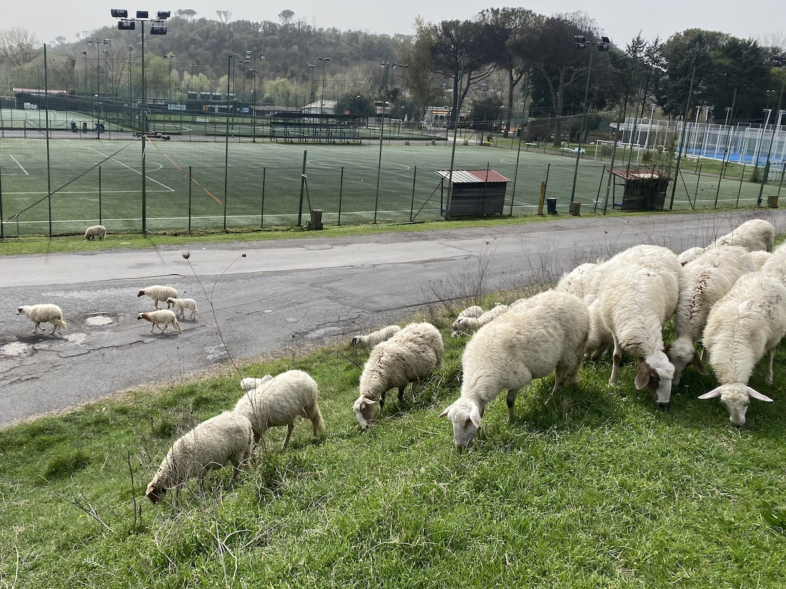
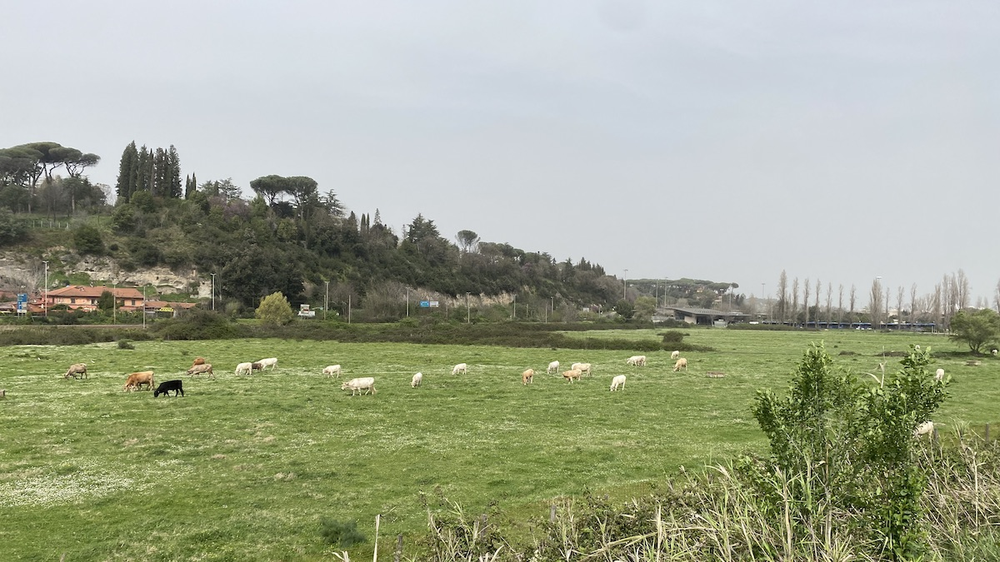

⏱️ 02:37&nbsp;&nbsp;&nbsp;⇄44.1km&nbsp;&nbsp;&nbsp;⌀16.8km/h&nbsp;&nbsp;&nbsp;↗170m&nbsp;&nbsp;&nbsp;↘180m

Friday is often bicycle day, and it was yesterday. Originally I thought of doing another train-based ride, but I changed my mind and stayed in the city. Well, sort of.

===

Although there are now quite a few kilometres of dedicated cycle paths in Rome, some of them even separated from motorised traffic (apart from speed-crazed e-bikes), there's only one that allows you to ride for several kilometres without encountering any traffic. It runs alongside the Tiber and I normally turn right when I hit the river and cycle south. This time, I decided to go north.

{.center}

I hadn't done so in years, and the last time it felt a bit sketchy because the path went by a large raggle-taggle encampment, complete with scary dogs and scarier youths, and I remember wondering whether I could outrun either faction. This time, no such problem and, in fact, no sign of where they had previously been.

{.center}

An interesting aspect of Rome's geography is that fingers of countryside poke quite deep into the city. As a result one is likely to be surprised by a flock of sheep in quite built-up areas, vying for space with sporting clubs.

{.center}

Likewise cattle, though these are a lot further out, not far from the main TV studios of RAI. What the picture doesn't show, because they had all flown off, is the scores of cattle egrets feasting in the grass. Although they are quite common, I still find it odd to see them here.

{.center}

No motorways or railway lines to cross over, but I did pause over a little stream, the Fossa della Crescenza, on its way to the Tiber about 200 m away. Checking on the stream's name, I discovered that each part of the cycleway there is named after a partisan woman. I'd seen noticeboards to that effect along the way, but failed to stop and take notice at the time. At this point, the cycleway commemorates [Adele Bei](https://en.wikipedia.org/wiki/Adele_Bei), who seems to have had quite a life.

{.center}

The cycleway ends at a big bridge that carries the main Roman ring road over the Tiber. You can actually cycle along the bridge on a dedicated section and come back into town on the other side of the river, but I didn't feel up to it. After a little rest, I turned around and headed back, and got a huge shock. There was a wind of about 15 kph blowing straight at me. Of course I hadn't noticed it on the way out, but on the way back it certainly gave me more of a workout than I expected. That may be why I was more than happy to stop and take a few photos on the way back.

{.center}

I speculated that this chimney rising over a set of ruins might have been a brickworks, and [it was](https://zonaromanord.it/saxa-rubra-la-storia-dellantica-fornace/). Not that old though, apparently it was in operation from the 1940s for about 30 years, after which it became one of the settings for a string of cop movies because "the area around the kilns, with its mysterious man-made caves, lent itself well to that kind of story".

{.center}

And finally, at least for photographs, a fun face on some kind of giant plumbing structure at the sewage farm for north Rome.

After that, it was just pedal, pedal, pedal to get home, and this elevation profile, snagged from Komoot, shows just why going anywhere for a bike ride is a challenge. The start is pure joy as I whizz down off the hill, but that same hill has to be climbed after the ride.

{.center}