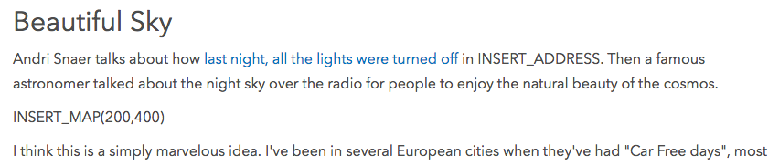

---
title: 'Not entirely dead'
published: true
date: '13-11-2019 17:45'
taxonomy:
    category:
        - blog
    tag:
        - Geeky
summary:
    enabled: '1'
subhead: " "
header_image: '0'
--- 

Many reflections are prompted as I slowly continue to bring old posts in, based on what the logs tell me someone is looking for. One of today's old posts was remarkable because it was the first time that not a single important link in a reasonably substantive post was still alive.

===

[Dark and stars](https://www.jeremycherfas.net/blog/dark-and-stars), from October 2006, contained three links.[^1] I diligently searched the Internet Archive, and it had one of them. It also helped me see that the other two had changed their main URL, and I was able to use search there to find the missing posts. The biggest mystery, though, was the post that had first alerted me to Rekjavik going dark for a night. IA had it, which was fine. And I was about to leave it at that when a tangential discussion about what constitutes an active blog prompted me to rethink. In that discussion, I said:

> I think my cutoff would be domain gone. I've been pleasantly surprised to discover sites arising phoenix-like, *via* RSS.

Just on a whim, then, I tried the root URL of High Earth Orbit, and it was indeed alive and well, belonging to [Andrew Turner](https://twitter.com/ajturner), Director and CTO of Esri R&D in Washington, DC. Esri is kind of a big deal in geospatial circles, the very far fringes of which I occasionally frequent. So that was interesting. Was the original post still there?

There wasn't anything as simple as search on Andrew's site, at least not that I could find, but I did track the original article down, [so here it is](http://highearthorbit.com/articles/beautiful-sky)

{.center} 

Why am I telling you this? Because it sort of amuses me, and I realise this is a stone thrown by a glasshouse dweller, to see that even an "idealistic technocrat" can make mistakes when moving old posts to a new engine, one reason why I continue to do it slowly, by hand.

I wonder whether he accepts webmentions?[^2]

[^1]: I'm not counting the credit for the photographer, who is still there on Flickr.

[^2]: Nope.
