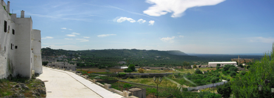

{.center}

My photographs are part of who I am, and I enjoy sharing them with people and getting their reactions. But I have never yet been entirely happy about the way I do that on the web. Flickr is marvelously simple, but everyone’s pages look essentially the same; only the photos differ, and while some would say that’s all that matters, I like to tweak how things appear. The photoblog was fun, and let me to control the overall look of the page, but it was a drag having to upload to it specifically, and there’s been no sign of any interest in being able to blog to PixelPost direct from Flickr. So I gradually stopped using it. I’m using the plug-in to show the four latest Flickr pictures here, and considering uploading in batches of four. But I’d like something else, something I have now [realised](https://web.archive.org/web/20070812042004/http://jeremycherfas.net/wp/photos-main/). But I still need to style it. That may take some time ...

! 2022-06-04: And the problem is still not solved. I somehow doubt it ever will be.

