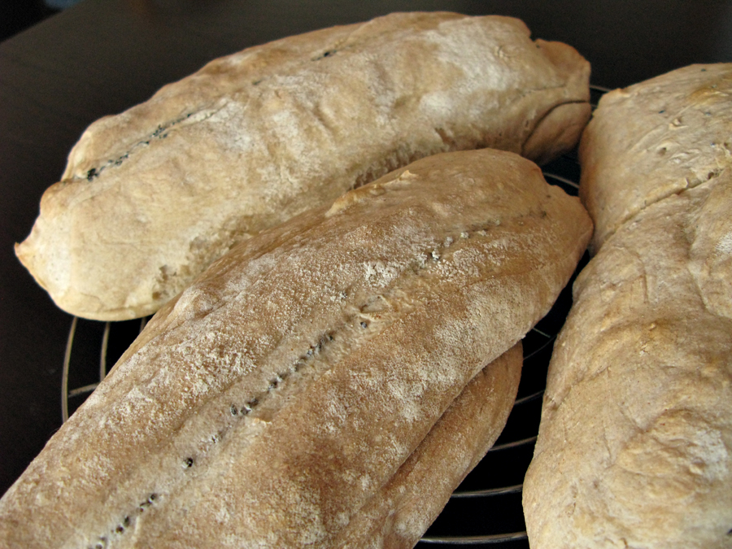
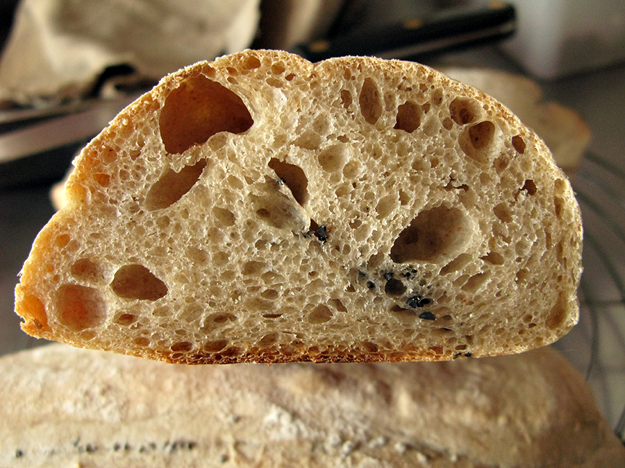

Like any craft, I suppose, my bread-making is torn between tramping the paths of old familiar loaves, where I know my destination will be pleasant, and exploring new ideas which, gasp, might take me to a bad place. Susan's recipe and photographs for her [Open Sesame Pain de Beaucaire](http://www.wildyeastblog.com/2011/10/26/open-sesame/), however, gave me itchy feet. First, there was the promise of an entirely now shaping method, one that resulted in a beautiful loaf. Secondly, there was Rusty Wright wondering in the comments how it might taste with nigella seeds instead of black sesame. Well, I have kalonji, and I love the taste it gives to bread. So I wrote down Susan's instructions, built my leaven, and went ahead.

One thing puzzled me. Susan said in her post that the dough would be stiff. I did a quick calculation based on the quantities she gave, and the hydration was about 58%. As I commented, not THAT stiff. But one thing I've learned when exploring a new bread, follow instructions first; then tweak one thing at a time. So I followed instructions.

The dough was not in the least bit stiff. If anything, it was looser than most of my recipes. As Susan foretold, I had trouble standing it up on the baking tray. And in the oven the split that was supposed to open up to give the bread its characteristic shape failed to do much of anything.

{.center}

Which was, I confess, a little disappointing. I did a bit of hunting around, and found a couple of other recipes, and both of them seemed far more hydrated than I would call stiff. [Steve B's gorgeous loaf at Bread cetera](http://www.breadcetera.com/?p=121) comes in at 61%, while [Anja's wholewheat version](http://bochenkowo.blogspot.com/2011/06/whole-grain-pain-de-beaucaire.html), which also looked good, I calculated at 68%. The proof of the pudding though, is in the eating, and that did not disappoint.

{.center}

The crumb was wonderfully open, the crust not thick but chewy nevertheless. And the flavour of kalonji perfused the bread just as I had hoped.

So what now? Add this to my repertoire as is? Or try it with a stiff dough, which by my reckoning would be around 55% hydration, or less? That would mean 342 gm or less of water instead of Susan's 402 gm. It does seem worth trying to get that lovely open split with the seeds embedded in it. I think I'll go very stiff, at 50% (296 gm water), next time.