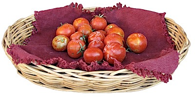
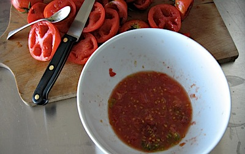

Who says you can't go back?

{.center}

All those tomatoes, all those seeds. I felt the old stirrings. So when I got home this evening I picked everything that was not absolutely green, paused momentarily to snap a faintly artsy shot (see above) and repaired to the kitchen. Slice and scoop, with a nice small teaspoon, pausing only to munch the shells that weren't too rotten or blemished. There's nothing to beat a salted sun-warm tomato, except a salted sun-warm tomato from which you have just saved the seeds.

After who knows how long (I do believe I might have been in a state of flow) a bowlful of seeds and a pile of empty shells cried out for another photograph (see below).

{.center}

The shells will go in the bin (no composter on a terrace) and the bowl will go outside to ferment. There's just enough time to get clean seeds drying before I have to hit the road again.

Boy, does that feel good.