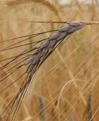

Scientists in the US and Israel have discovered a gene that can boost the protein, iron and zinc levels of modern wheats. It is present in wild emmer wheat (_Triticum turgidum ssp. dicoccoides_) but somewhere along the way to modern bread and pasta wheats became non-functional. Inserting the gene into modern wheat -- by normal breeding, they hasten to say, not genetic engineering -- raises the protein and minerals by about 10 to 15 per cent. Modern wheat does have genes that are similar to the “wild” gene, which has been called Gpc-B1 for its effect on grain protein content. Blocking the activity of those genes in modern wheats causes the plants to live longer, but depresses the amounts of protein, iron and zinc even further.

===

{.left} The science of the discovery is intriguing. At the simplest level, Gpc-B1 seems to control not only the time at which the flag leaf, the big leaf just below the ears of grain, dies, but also the movement of protein, iron and zinc from the flag leaf into the grain. The actual [research paper](https://web.archive.org/web/20100824193248/http://www.sciencemag.org/cgi/content/summary/314/5803/1213i), in the 24 November issue of Science, requires a subscription to read, but you can find more from the University of California Davis's [press release](https://www.eurekalert.org/news-releases/554656) and some press reports.[^1]

[^1]: 2021-11-24: I originally linked to three; not one remains.

To be honest, I had expected more press coverage, not least because this is the third report in a week or so that sheds light on genes and nutrition, but it may be early days yet. The first, [genetically engineering cotton seeds](https://www.eurekalert.org/news-releases/529301) to get rid of a harmful compound called gossypol (once considered a contender for a male contraceptive) did indeed get a massive amount of attention. The second, a technical tour-de-force that showed [where seeds store iron](https://www.eurekalert.org/news-releases/820403) and how more of it can be made available to the plant and to people who eat the plants (or possibly just the germinating seeds) more or less vanished without trace. But all the coverage I have seen stressed one thing: world hunger.

One in three children worldwide is underweight and malnourished, and “hunger [claims the lives](https://www.science.org/doi/10.1126/science.1136251) of 20,000 children a day”. Two billion people suffer micronutrient deficiencies. The idea that a gene, or genes, can solve these problems at a stroke, as it were, is appealing. Wheat supplies  roughly a fifth of all the calories people eat. Boost the protein and mineral content just a little, the argument goes, and you go a long way to eradicating malnutrition. Fix the staple crops -- usually by genetic engineering, but that‘s irrelevant -- and you fix the problem.

Personally, I think this misses the point completely.

So nu-food wheat boosts protein and iron by 10 to 15 per cent? A dish of pumpkin leaves, preferably cooked with a little oil, delivers much more iron and a healthy dose of protein, with roughly twice the daily requirement for vitamin A thrown in for good measure. And the pumpkins are already being grown in places where these deficiencies are acute. Millets not only deliver better nutrition than wheat, they also offer farmers a much greater income and do much less damage to the environment.

All around the world, there are diverse, often local, crops -- fruits and vegetables, cereals, legumes, other grains -- that offer a far better deal nutritionally and environmentally, but that have suffered under the hegemony of the big three; wheat, rice and maize. But the silver bullet approach continues to dominate so much agricultural research.

The Bill and Melinda Gates Foundation, for example, gave US$ 7.5 million to develop a super-cassava. Cassava is a vitally important calorie crop in Africa, but it doesn‘t contain much in the way of protein or micronutrients. It can be toxic. And it is susceptible to virus diseases. So the Gates Foundation asked scientists to fix those deficiences. And the scientists are only too happy to oblige. “Eventually, we‘d like to bring all of these traits together into one variety of cassava,” Richard Sayre, the scientist leading the team, [said](https://news.osu.edu/research-team-receives-75-million-to-study-cassava/).

Gates presumably gets the best advice money can buy, but this is woefully outmoded. Sayre is a plant breeder. Has he never heard of [southern corn leaf blight](https://www.science.org/doi/10.1126/science.171.3976.1113), the disease that wiped out half the US maize harvest in 1970? How come? Because maize breeders had used a nifty little gene, called Texas male sterile, to ease the job of making hybrids. For years, schoolchildren and college kids in the midwestern states had made handy money in the summer wandering up and down rows of seed corn de-tasseling -- castrating -- the mother plants, so that only the pollen from the father plants went into the seeds. The male sterility gene did the job genetically, depriving those kids of an income but making maize-breeding more efficient. And making all the maize that contained the gene susceptible to southern corn leaf blight. Boom -- an epidemic.

Genetic uniformity inevitably leads to increased vulnerability to pests and diseases. And genetic diversity, in and of itself, is an effective weapon against pests and diseases. This is not the place for an extended discussion of that basic premise. My intention is simply to point out that magic bullet solutions -- for wheat, for cassava, for rice, for anything -- contain the seeds of their own destruction. That is true of the whole of agricultural history. The first farmer to select an improved wheat from the wild emmer growing all around, for example, took the first step onto a treadmill.  The thought of a single variety of Gates Über-root over-running Africa conjures, for me, a vision of the Irish Potato Famine, in spades. Likewise, a nutritionally improved wonder wheat will do almost nothing sustainable to feed the rural poor.

Their salvation lies in diversity. Crop diversity. Species diversity. Nutritional diversity. One could do an awful lot in that direction with $7.5 million plus a bit of whatever else is going into making magic bullets.

To be fair, the scientists who discovered the grain protein content gene in wild wheat are very circumspect about the prospects. The gene, they say “may contribute” to the more efficient manipulation of senescence and nutrient remobilization in crops, and this may “translate into food with enhanced nutritional value”. But that modesty doesn‘t last long. Nor, I suspect, will the improvements being sought.

Picture shows wild emmer wheat in its natural habitat north of the Sea of Galillee, Israel, courtesy of Zvi Peleg and Assaf Distelfeld.

Cross posted to [Agricultural Biodiversity Weblog](http://agro.biodiver.se/2006/11/nutrition-genes-feed-fantasy/).

