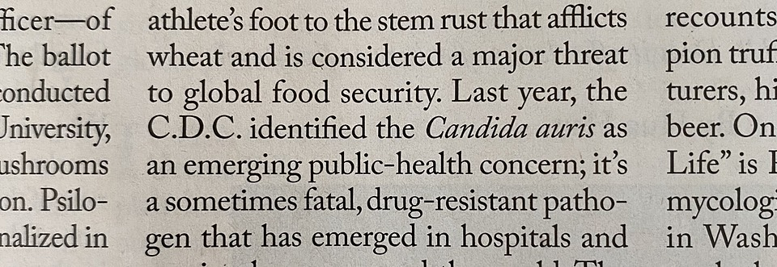

I’ve ranted many times here about the wanton misuse of biological scientific names. Those are the things, generally in italics, that name a species in such a way that we can all agree what it is we are talking about; *Rudbeckia hirta*, for example, rather than [black-eyed Susan](https://www.jeremycherfas.net/blog/i-love-latin). 

People are forever mistakenly referring to the *Rudbeckia hirta*, which is just plain wrong. A scientific name is a [strong proper name](https://www.jeremycherfas.net/blog/eagles-point-the-way), which never takes a definite article.[^1]

So it was with amazement that I saw *The New Yorker*, of all places, famed as it is for the breadth and depth of its fact checking and grammarian exactitude, refer to “the *Candida auris*” on page 66 of the 18 May, 2020 issue.

 

This was in a review of the Merlin Sheldrake’s[^2] book on fungi, which sounds like it might well be worth a read, as an old fan of Paul Stamets and fungi in general.

[^1]: Unless, of course, you had two specimens and wanted to say something like “the *Rudbeckia hirta* on this herbarium sheet is very different from the *Rudbeckia hirta* over there.”

[^2]: See what I mean?