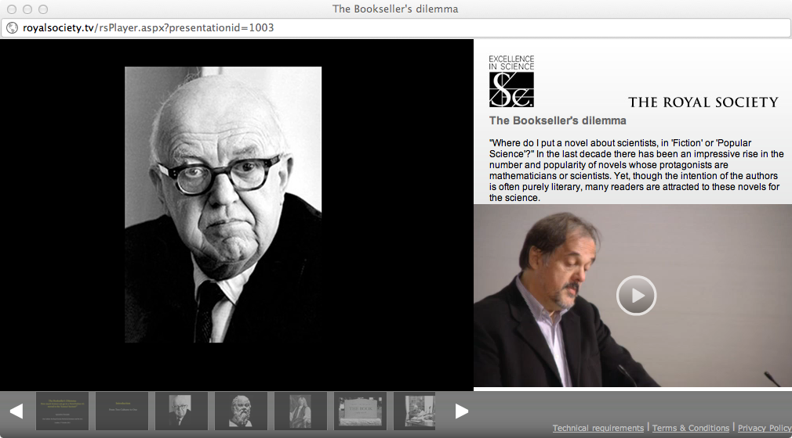

I heard this woman from Southampton University give a talk called [History of the Web Part I](https://royalsociety.org/science-events-and-lectures/2011/history-web/) to the Royal Society, and it was quite good, even though, possibly even because, there were a couple of things I disagreed with.

And being a glass half full sort of guy, most of the time, we could leave it at that.

Most of the time. But today, my glass is half empty. So I’m going to moan. I subscribe to the Royal Society's podcasts,[^fn1] which is how this happened to be available to me. But nowhere does the podcast tell me that the speaker was Professor Dame Wendy Hall, FRS. Other podcasts manage to include the speaker’s identity and more; how hard can it be?

Moving on, the podcast is audio only. Fine, no problem, except that Professor Hall clearly had some very interesting slides that she was sharing with the audience. But hang on a moment. On the page for the event, there’s a link that says “Watch the video”. So I did. And that seems to be the identical audio (a little longer, rather than cut off in mid sentence as the podcast is) linked to the slides. Which is nice. But hang on another moment. Why not share that, rather than pure audio? Makes no difference to any of the podcast technology. And lo, [they do](http://itunes.apple.com/it/podcast/royal-society-video-podcasts/id276461286); I have changed my subscription. Pictures and a voice is better than a voice and no pictures.

Better yet, why not video the speaker and do a modest amount of editing before splicing in the pictures? I reckon just cutting out the number of times Dame Wendy told us she was running out of time and needed to speed up, plus a little bit of judicious de-umming, could have brought her in well under the 30 minute mark. And it isn't as if you need to be the BBC to do that kind of thing. The average acned teenager is fully competent.

{.center}

In fact, The Royal Society is fully competent. They host [scads of really good videos] ~~http://royalsociety.org/royalsociety.tv/~~,[^1] with spiffy technology (see above) that shows the speaker and their slides simultaneously and allows you to jump from slide to slide. Nice! But there’s no RSS feed, and I can’t see a way to subscribe to those videos.

There now, that’s enough moaning for now.

About that stuff I disagreed with. Dame Wendy said a couple of times that you have to be the biggest on the web to matter: you’ve got to be where everybody is, or there's no point being there. Not so, for me. Being the biggest, I reckon, will be the doom of Facebook and Google for me eventually. Sure I want all the information I can get, but there is a limit to the size of the communities that I want to be part of. The problem with giant online “communities” is that they think I care about what the other 99.999999% are up to, and much of the time, I don’t.

[^fn1]: Not, I hasten add, R.Science, which seldom manages to hold my attention, but [The Royal Society Audio Podcasts](http://itunes.apple.com/us/podcast/royal-society-audio-podcasts/id105000706), something else entirely. 

[^1]: All now apparently on [YouTube](https://www.youtube.com/channel/UC5MOW8BO3dH38Fo3Rau17KQ)
