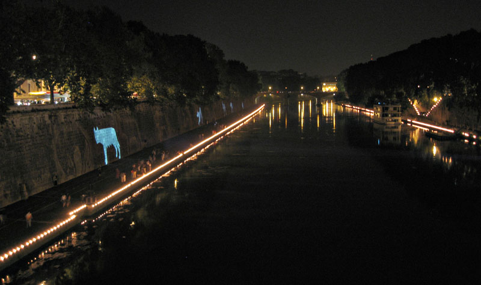
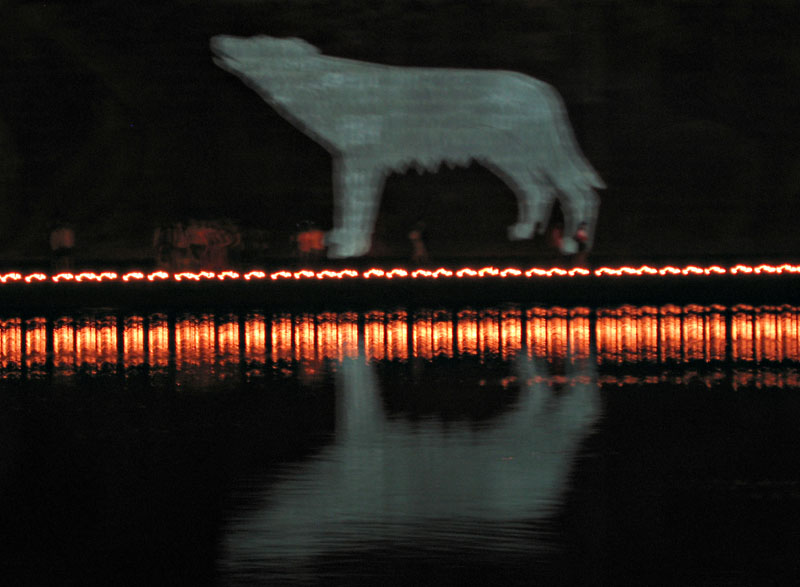

{.center}

Summer Solstice last night, so the year is downhill all the way from here. But the magic of last night will last a while. On a very straight section of the Tiber, between Ponte Sisto and Ponte Mazzini, [Kristin Jones and her crew]~~http://www.tevereterno.it/tevereterno.html~~ exhibited one of the best pieces of public art I have ever experienced (watch out; her site is way over-designed and more or less unreadable -- but pretty).[^1] Where last year there were glorious [Capitoline wolves](https://en.wikipedia.org/wiki/Capitoline_Wolf) stencilled into the dirt of the travertine embankment, this year they moved.

[^1]: 2022-07-23: And, currently vanished without trace, the ultimate disctinction of a website supposedly dedicated to the Eternal Tiber.

Vast industrial projectors, each linked to a computer, shone their stuff across the river, lined by thousands of candles. Wonderful, ethereal music played. The air was heavy and steamy, as humid as earlier but a little cooler. Everywhere along the bank little knots of people sat or strolled, some chatting almost unaware of the displays, others silent and engrossed. 

I cannot believe I didn’t take a tripod, but I didn’t. And my pictures barely begin to do justice to it. Nor do some that appear to be official, on [Flickr](https://www.flickr.com/search/?sort=interestingness-desc&text=tevereterno).[^2] Here’s hoping that there is some kind of record, though whether such a thing could possibly stir the emotions like the real thing is anybody's guess.

[^2]: 2022-07-23: Also underwhelmingly curated.

You had to be there. I’m glad (feeble bloody word) I was, having missed it last year. If you were, and you find this, please let me know of anything else available on the web.

Also, thanks to the gods of whatever, who insured that although I lost my little camera bag, I had stashed the full card in my pocket not in the bag, which I never do.
