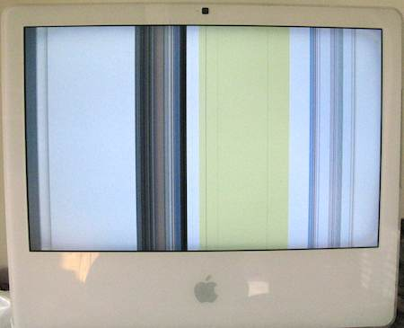

This does not look good.

{.center}

Not aesthetically, and especially not technically. It is a screenshot of my Mac at 13.36 yesterday. We’ve had some display issues in the past, mostly fixed, at least temporarily, by installing a little gizmo-app that speeds up the fans and keeps things cool. But this is different. The machine froze up completely. I got it back, but it is only a matter of time before it needs replacing. Why not repair? Because, for the first time I can remember, a Mac is obsolete before it is broken, at least if I want to run Lion, which I quite do.

Later ... It died again. Later just became sooner, as I await delivery.
