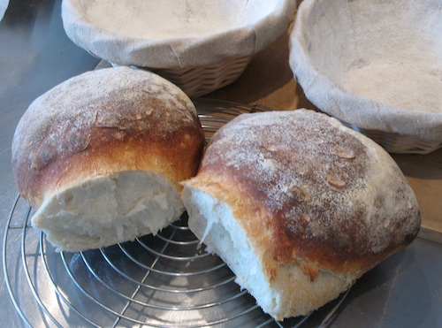

{.center}

These two loaves came out of the oven yesterday about an hour before lunchtime. Sometimes, I just want a plain, white bread; no seeds or other goodies, no interesting flour mix, no glaze. That’s what I got, and it provides a focus for a post inspired by GOOD’s [Food for Thinkers](https://www.good.is/tag/food-for-thinkers) series. That smorgasbord is coming together thanks to new editor Nicola Twilley’s question: What does it mean to write about food today? Some people have taken that literally. Others, myself included [over at the other place](https://agro.biodiver.se/2011/01/medieval-soldiers-illuminate-modern-stunting/), have written about food as they have always written about food, without too much introspection or analysis.

{.left} Why do I care about food? Because [Food is necessary to sustain life](https://web.archive.org/web/20130522185109/http://sporkful.posterous.com/eating-a-fact-of-life), as one Thinker put it? Well yes, but that doesn’t make it worth caring about, [as another pointed out](https://www.good.is/articles/simple-cooking-s-john-thorne-describes-the-mysterious-pleasure-of-vienna-sausages). I’ve come to realise over the past few years that for me food and cooking offers [Dan Pink](https://www.danpink.com/books/drive/)’s perfect motivational trifecta of autonomy, mastery and purpose. I cook because I can, because I’m continually learning as I do so, and because it gives others pleasure, and that pleases me. 

And then there’s the sheer magic of it. That bread: three ingredients, not counting a couple of squillion diverse micro-organisms. Flour, water, salt. Add technique, time and high temperatures and the transformation is simply astonishing. It remains so every time I pull a loaf out of the oven.

The learning thing, though, is central to why I care about food. The title of this post is an homage to [Harold McGee](https://www.curiouscook.com/)’s wonderful *On Food and Cooking*, a hardback first edition of which has been near me since 1984, and which I actually read cover to cover when it came out and still consult frequently. So I know why my loaf forms a good crust, how spraying with water and making steam in the oven make a difference, why the crust is brown, how different kinds of flour affect the crumb structure, the trade-off between salt and rising, and all that. I’m still learning, of course, about which more later, and yet the more I learn, the more there is to learn. Some friends disparage me as too sciency, but I’m happy where I am, knowing why I am doing what I am doing in the kitchen.

The same goes for the non-culinary aspects of food. How ingredients are grown, how they fit into local and global economic webs, the history and wanderings of foods and techniques, odd bits of food trivia that lodge in my brain like spinach in my teeth.

I am curious, and that’s all there is to it, and I suppose I am most curious about things that are necessary to sustain life because I have only the one life and I want to enjoy it.

Which doesn’t begin to explain why I write about food, or what that means. Probably it means nothing. Many things I write to help me understand them. And having done that, especially now that “publishing” takes nothing but time, why not share it, in case others want to learn a bit too?

As this post proves.

Back to those loaves, and why they prompted this post. Home from non-Pink work on Friday night, I knew I wanted and needed to make bread to bake on Saturday morning. I did some rough calculations for a plain and simple white sourdough, mixed all the ingredients together and found the dough much drier than I had planned. I weighed it. A hundred grams less than I had planned. Back to the rough calculations. Yup; stupid arithmetical mistake. Not enough water.

What to do? Adding more water, especially that much more water, to a bread dough is difficult. I could have chucked the whole mess and resigned myself to going out to buy bread next morning. Instead, I chopped slices off the dough and roughly mashed them into the water. It was a lumpy mess with about as much structure as the early universe, and slimy with it. I [stretched and folded](https://web.archive.org/web/20070420030045/http://www.sourdoughhome.com/stretchandfold.html) it, and it might have been my imagination, but it seemed to become a little more like dough. Into the bowl and 20 minutes later -- we were going out to eat -- another stretch and fold. Maybe it was coming together. Four hours after that, it had actually risen a bit and got one more stretch and fold before going into the fridge overnight. Next morning -- whammo! -- good, well-structured dough, which I formed into balls, allowed a second rise, into the oven, and there they were.

A couple of years ago, I would not have known about stretch and fold. I would either have continued with a too-dry dough, which would have been OK, but. Or I would have dumped the lot. Instead, I managed to make a more than decent bread.

That’s why I care about food. And that’s why I write about what I’ve learned, in case someone is looking to learn the same sorts of things.
