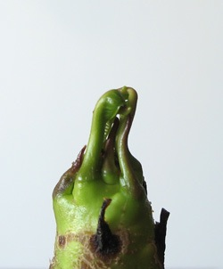

{.left} The [magic frangipani](http://jeremycherfas.net/blog/impatience-rewarded-too/) made it through its second winter. Almost three weeks ago, in fact, I noticed that the leaves had started to unfurl, and a little bit of me unfurled too. I took the photo there and then, on 21 March, but it sat in the camera until today and the trunk sat in the passage-way until last weekend, when it moved out onto the terrace. Checking back, I discovered that last year the [first stirring](http://jeremycherfas.net/blog/patience-rewarded/) of the leaves took place very much later, around mid-May. I expect part of the reason is that this year I brought it indoors in December. Or maybe not. The much greater mystery is whether the flowers will come earlier this year. It would be so rewarding if The Squeeze could see and smell them for herself.

Elsewhere on the terrace I’ve been waiting for the irises to pop open. I bought a pot-bound little specimen late last summer, brought it home and released it. Cut it up into the smallest pieces I thought had a chance, and planted them in a shallow tub. They took. Some sent up flower stalks a couple of weeks ago. At first I thought I had been sold a pup; the buds seemed pale, and I had bought the thing because it had a dark brownish-purple flower on the label, a sort of bruised aubergine. Slowly, as the days have passed, the buds have darkened and I am again hopeful. Maybe they’ll open for _pasquetta_ lunchtime. That would be nice.
