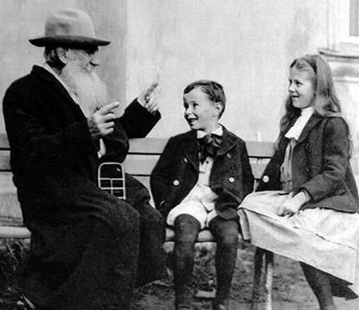

> He was nine years old; he was a child; but he knew his own soul, it was dear to him, he protected it as the eyelid protects the eye, and did not let anyone into his soul without the key of love. His educators complained that he did not want to learn, yet his soul was overflowing with a thirst for knowledge. And he learned from Kapitonych, from his nurse, from Nadinka, from Vassily Lukich, but not from his teachers. The water that his father and the teacher had expected to turn their mill-wheels had long since seeped away and was working elsewhere.

{.center}

Lazily searching for those words, so that I wouldn't have to retype them, I came across what must be an [out-of-copyright earlier translation](https://web.archive.org/web/20160831221914/http://literature.org/authors/tolstoy-leo/anna-karenina/part-05/chapter-27.html), probably Constance Garnett's. All I can say is, I'm more than glad I waited until last year to make my belated start on Russian literature. I have neither expertise nor comparisons to make, but [Richard Pevear and Larissa Volokhonsky](http://online.wsj.com/article/SB10001424052748704431804574539613167679976.html) must be the best around. Maybe I won't continue to read just Russian literature; I'll read Russian literature as rendered by them.
