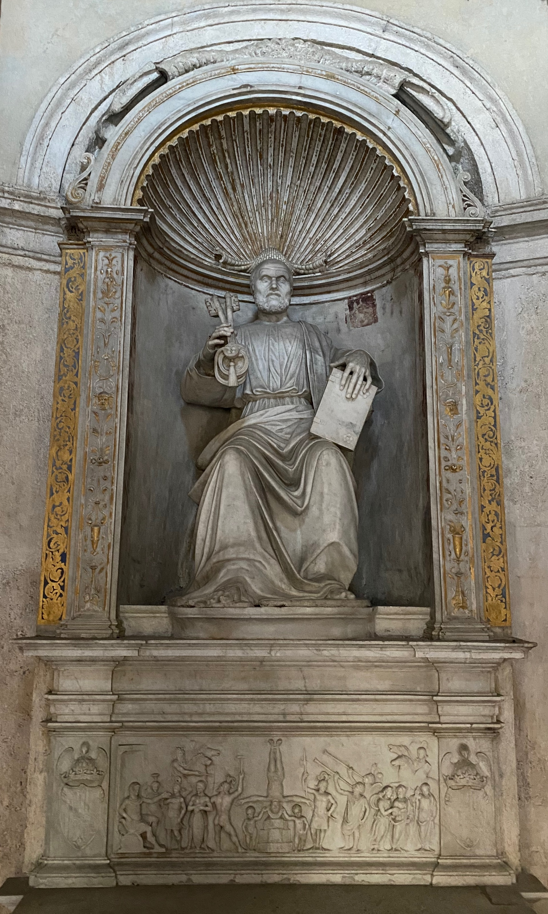

Many countries have academies in Rome, the most famous of them probably being the American Academy in Rome. Artists of various stripes enjoy a stipend and a variably good life, generally working on something to do with the city, and the various academies open their artists' studios to visitors from time to time. These are usually great fun, for art and for socialising. Last night was my first time at the Spanish Academy in Rome.

Wow!

===

The Spanish Academy is probably best known as enclosing Bramante's lovely little Tempietto, visible normally only through the bars of the locked gate. Open night at the Academy meant a clear view.

{.center}
<figcaption style="font-style: italic;">The Tempietto, in a courtyard of the Spanish Academy</figcaption>

Inside is an altar to Saint Peter, who, according to Wikipedia, was matyred on this exact spot.

{.center}
<figcaption style="font-style: italic;">St Peter with the keys and, below, his matyrdom</figcaption>

The most attractive part of the visit, I sheepishly confess, was not the art within the studios but the views of the their wonderful windows, which gave onto familiar far-distant views and unknown sights nearby.

{.img-fullwidth .u-photo}
<figcaption style="font-style: italic;">A panorama</figcaption>

There was also visual joy within some of the windows.

{.img-fullwidth .u-photo}
<figcaption style="font-style: italic;">Leaves trapped behind the glass</figcaption>

There was, of course, some wonderful art. I was taken by the very simple, large paintings by Elvira Amor, the woman who used these pigments.

{.img-fullwidth .u-photo}

<figcaption style="font-style: italic;">Elvira Amor’s colours</figcaption>

Carla Boserman, another artist I enjoyed, was doing really interesting things related to Italian statuary and food culture. I hope she’ll agree to come on the podcast.

{.img-fullwidth .u-photo}
<figcaption style="font-style: italic;">"Più con il farro che con il ferro"</figcaption>

A quick stop to record the moment, before plunging down to the final studio.

{.img-fullwidth .u-photo}
<figcaption style="font-style: italic;">The rest of the party</figcaption>

The very last studio we visited was occupied by a musician, Hugo Gómez-Chao. It’s a long way from all the others, with one of the gardens in front of it and a glorious view behind it. We heard a snatch of music for an opera Hugo is working on which slowly soared up and out and filled the space, mostly drowning out the completely cack-handed disco beats pulsing out from a naff rooftop bar across the way.

{.img-fullwidth .u-photo}
<figcaption style="font-style: italic;">Front garden for the music studio</figcaption>

{.img-fullwidth .u-photo}
<figcaption style="font-style: italic;">A view to inspire</figcaption>

 
 
