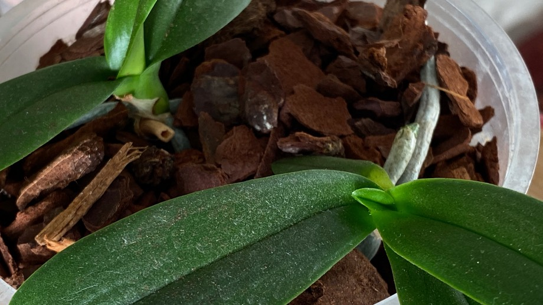
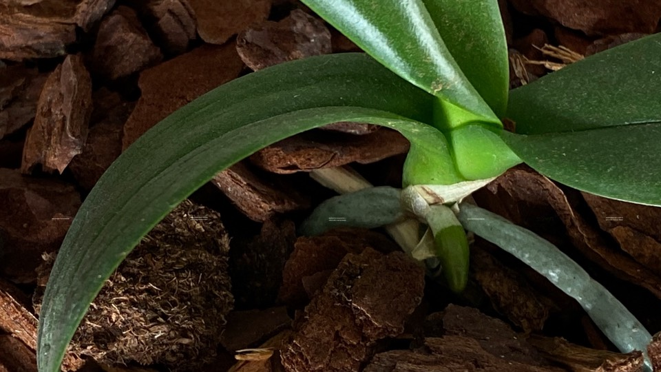
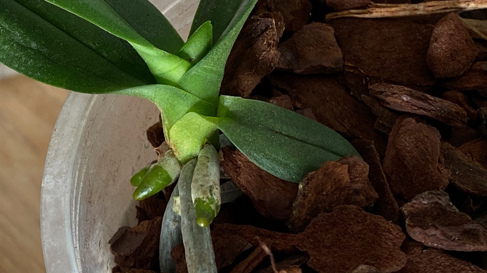
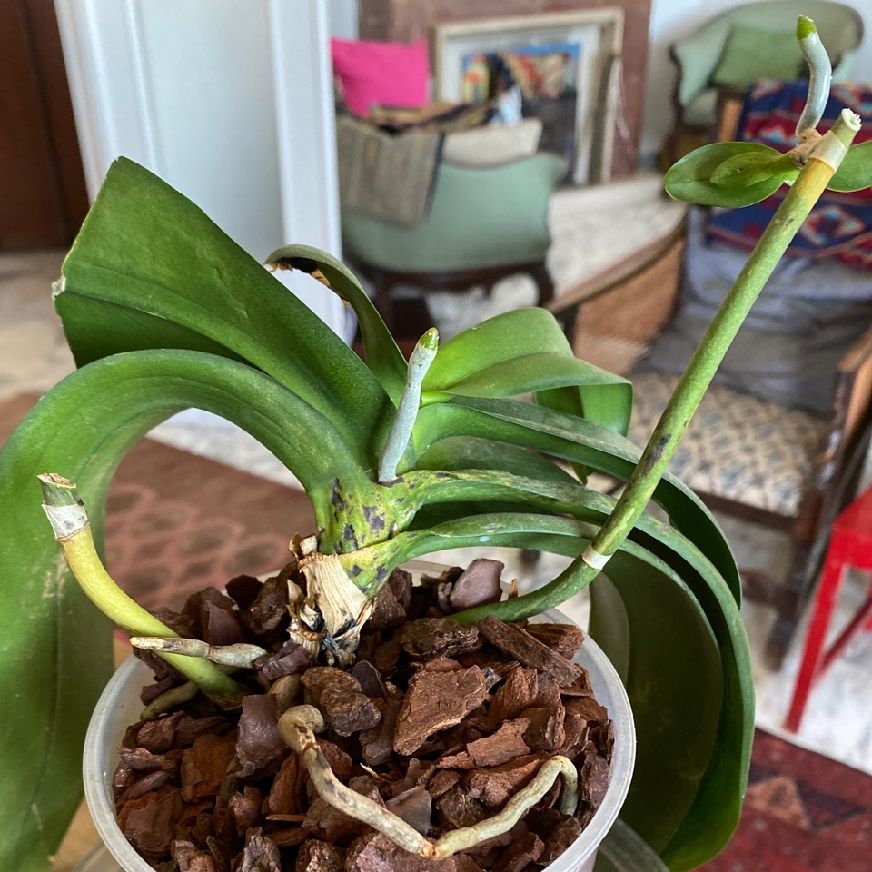

The [two baby orchid keikis](https://www.jeremycherfas.net/blog/repotting-my-revived-moth-orchid) have made definite progress during the week. Both are putting out new roots, and one, the larger by a smidgen, has a new leaflet.

[{.center}](leaflet-lg.jpeg)

[{.center}](rootlet-lg.jpeg)

[{.center}](root-leaf-lg.jpeg)

The parent plant I’m not so sure about. Although the newest leaf is glossy and turgid, the others are a bit limp and patchy. The two spikes I cut back are yellowing and the black spots at the base of the older leaves make me worry.

{.center}

All I can do at this stage is continue to mist them all every morning and hope for the best. No water for another week.