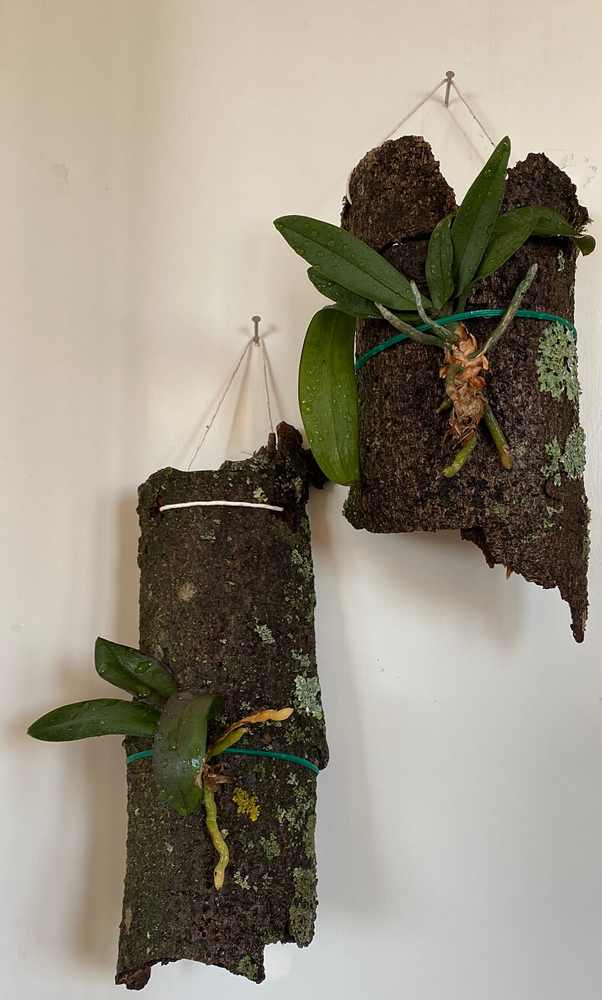

{.center} 

At the Casa Marina gardens in Key West last week, I was quite surprised to see orchids mounted on slabs of what looked like cork oak bark. My surprise, I later learned, was the result of my own ignorance, as it seems fairly common to attach orchids to a support and let them get on with it. I resolved to try something like that with two of my Phalaenopsis orchids that have not been doing too well, I suspect because the pots they are in are too big. Out on my first walk since coming home, I noticed a couple of downed trees, with easily detached bark, so I detached a couple of pieces and carried them home. The little plants are just wired on, without any moss to maintain humidity, which was what the internet later told me I should have used, so they will probably need to be sprayed at least once a day. Maybe if I find some sphagnum moss some time soon I'll add it as an afterthought, but in the meantime I probably won't lose anything by at least giving this a shot.
