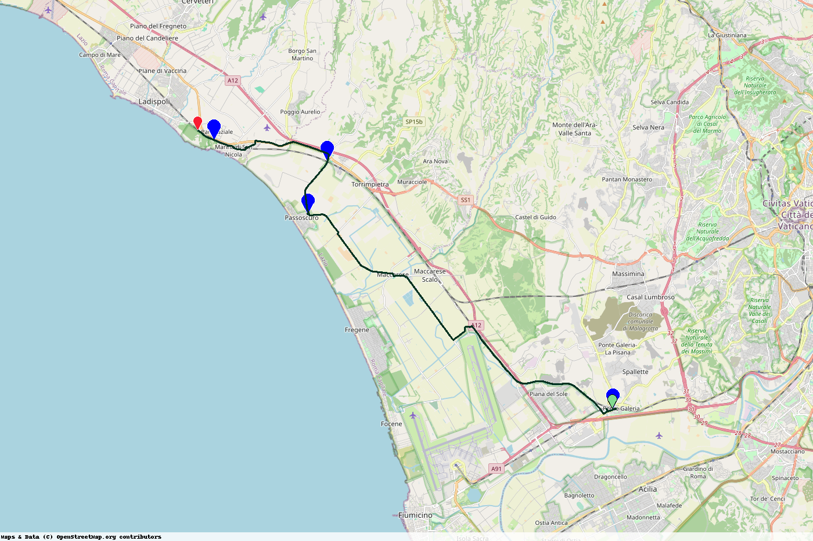
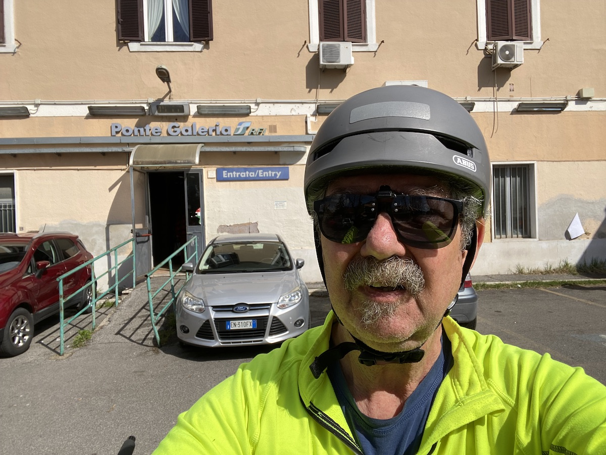
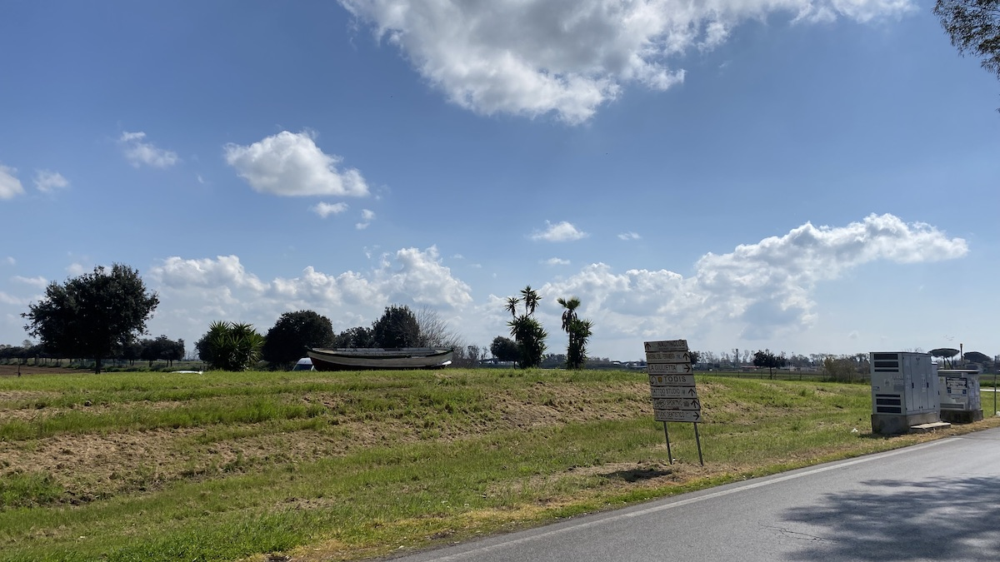
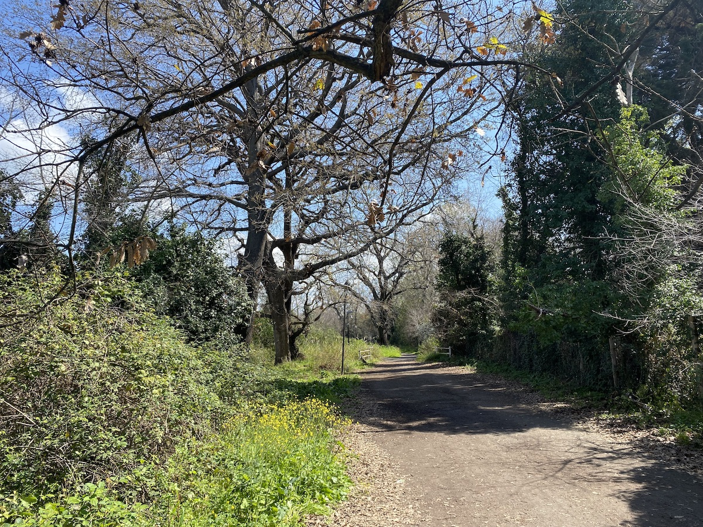
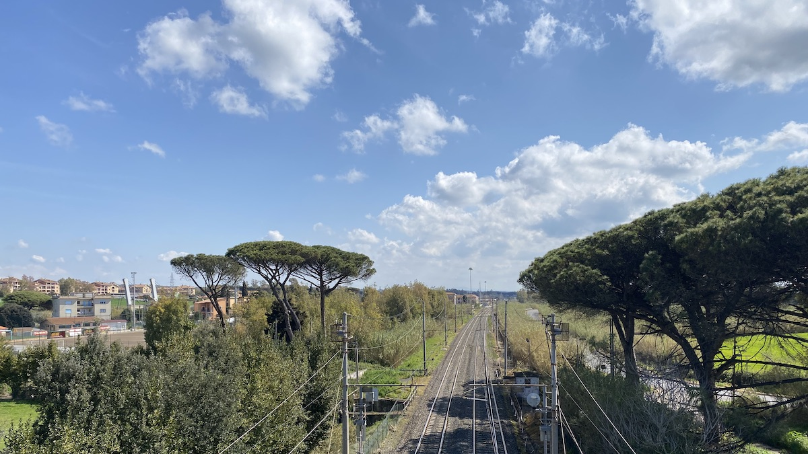

My very first [ride with Komoot](https://www.jeremycherfas.net/blog/riding-under-the-radar) was fine, and I appreciated the ease of saving a route and adding photos to it. At the same time, I moaned about wanting to own my narrative maps. This past weekend, with a bit of help from my mate ChatGPT, I reached a primary milestone.[^1]

[^1]: See what I did there?

I can plot the route on a static map with markers for any photos I choose to include.

===

{.center}

## The ride

Same deal; train out, ride, train back. Again, I chose to ride along the flatlands by the coast, this time from Ponte Galeria station to Ladispoli. I tweaked the route Komoot offered to go along smaller roads, and to tell the truth it was fine, just not very interesting. The area was once low-lying swamp that was drained early in the 20th century to create one of the largest farms in Italy, owned by the Benetton Group since 1998. There’s plenty of history and many modern stories to tell, but they take a lot of digging. Long straight roads criss-cross the whole area, but it just isn’t that much fun. As evidence, I took only five photos, one the almost obligatory selfie at the start and two where I happened to stop for a rest and drink.

{.center}

{.center}

The best part of the ride was near the end, where a cycle path took me through some residential areas where there were big trees, allotments (I think) and a generally peaceful atmosphere. Although the traffic throughout the ride was pretty respectful, it is always nice not to have to even think about that.

{.center}

## The Map

A scale would be nice, somehow. In the meantime, the ride was about 34km.

The markers are not (yet?) clickable to either show or take you to the photograph, but looking more closely at Komoot’s version, they aren’t clickable there either. Each marker does have a little number that corresponds to a photo, but the photos themselves are not numbered. Not that impressive.

I don’t think I can put text inside at the marker, at least not with the system I am currently using. However, I have always liked the way [John Johnston posts summaries of his walks](https://johnjohnston.info/blog/19030-2/), where eight photographs are colour-coded to match coloured markers on a map. He was kind enough to share his approach, which is very clever and which works well because he knows there are going to be eight and only eight photos. My longer term plan is to do something similar, but I haven’t yet thought my way through it. Do I want a coloured marker inserted on the photo itself, or somehow indicated nearby? What about a clickable set of coloured markers under the map that are linked to their respective photos? Many possibilities.

Will I share the manky Python script publicly before then? Probably not, but you can always ask.

As ever, I can never resist a photo of a motorway receding into the distance, in the absence of which I had to content myself with the railway tracks, which means you can easily work out which marker this corresponds to.

{.center}