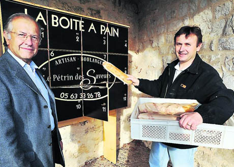

{.center}

[Marvellous story](https://www.ediblegeography.com/p-o-bread-box/). 

> "A compelling example of the potential that de-anchoring services from the static cartography of a fixed storefront holds to reconfigure diet, public space, and the food system itself." 

In essence, baker delivers.
