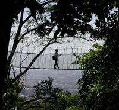

 {.left}

On Saturday a 15 ringgit cab ride brought me to the Forest Research Institute of Malaysia, at last away from the hotel-conference centre axis. It is a good place, full of interesting things to see and people seeing them. And if KL is very Blade runner, then the forest is very Raiders.

===

After a good hike up steep trails cut through the forest, you get to the canopy walkway. Three trees connected by rope bridges that really do sway rather alarmingly. Unfortunately there isn't much to see, not least because parties of COP7 delegates and schoolchildren frighten almost everything away. But with knuckles white on the supporting ropes, there's a good dose of safe fear and plenty of rumination about how much one would see if only one were alone and had time to stay and be quiet. KL looming out of its haze in the background does nothing to dispel the sensation of being immersed in something rather exciting.

There are lots of other trails cut through the forest, and I had my usual rainforest sensation (n=2) of being vaguely and bookishly familiar with what I was seeing at the same time as being totally out of my depth faced with all that diversity. And the same grasping at plants that, probably because they are houseplants, seemed at least a little bit familiar. Saw very few birds, no herps or mammals. Just once, out of the corner of my eye, I thought I saw a leaf move, but staring did nothing to reveal what had moved it.

Oddest of all was a very loud insect (presumably) whine, droning on incessantly at the same high pitched note with no hint of stridulation or vibrato to indicate that it might be a living sound. Just when I thought I might be about to develop notch deafness the noise would stop abruptly. Was it a single insect that had got tired? Surely one couldn't have been that loud. If it was a crowd, how did they all know to stop on a dime? And what the heck was it anyway?

More questions than answers, that's what I like about biology.
