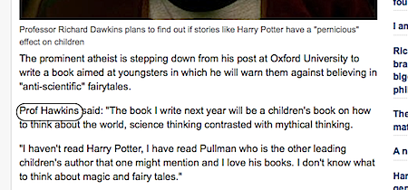

It is pathetic, I know, to seek inspiration in the errors of others, as I have done now two posts in a row. But it really is such a source of pleasure, even when I know I am surely setting myself up for retribution. But who can resist the [Daily Telegraph](https://www.telegraph.co.uk/news/3255972/Harry-Potter-fails-to-cast-spell-over-Professor-Richard-Dawkins.html) getting Richard Dawkins’ name wrong? And even more amazingly, when you google Prof Hawkins, who should be top of the list but young Stephen Hawking. Something very god is going on.

{.center}

!2021-11-08: Even more blissful to discover that the article is still there, the typo still in place.