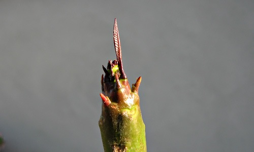

The winter here at Monteverde Mansions has been a little anxious in at least one regard. Just after we moved in late last autumn, knowing of my passion for them, dear friends gave me a fine, sturdy little frangipani. It even had leaves. All I had to do was see it through the winter and maybe, just maybe, I would be rewarded this summer with a flower or two. I found it a sheltered spot, watered it sparingly, and was horrified when some of the leaves got badly damaged by winter winds. One by one, off they fell. But the trunk remained firm to the touch, even as it became bare. In the end, _pace_ Nick Drake, there were no leaves left.

Spring came. Seeds germinated, cuttings rooted, growth restarted elsewhere, but still the frangipani remained resolutely moribund. But not rotten.

{.center}

Two days ago, The Squeeze and I independently notice stirrings. Yesterday I photographed it and breathed a sigh of relief. The worst of the wait is over.
