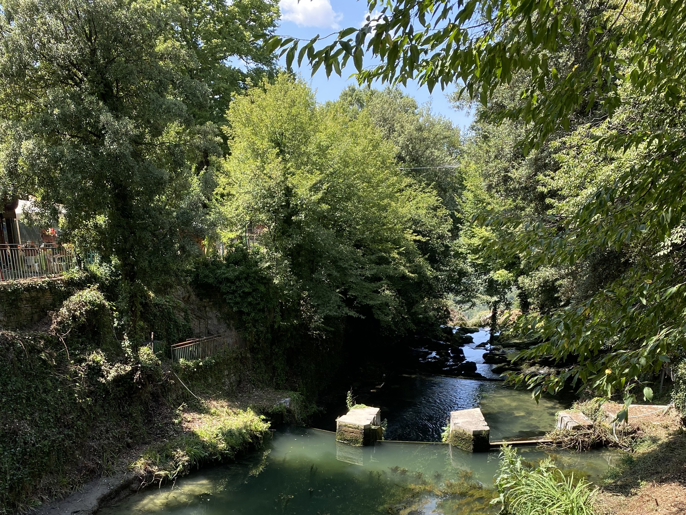

Veggies es bonus vobis, proinde vos postulo essum magis kohlrabi welsh onion daikon amaranth tatsoi tomatillo melon azuki bean garlic.

This is not a paragraph, although I don't know what it is.

Gumbo beet greens corn soko endive gumbo gourd. Parsley shallot courgette tatsoi pea sprouts fava bean collard greens dandelion okra wakame tomato. Dandelion cucumber earthnut pea peanut soko zucchini.

{.fig-image}
<figcaption>A bridge crossing a little stream with somewhat lush growth on the banks on either side. If you look closely you can also see a waterfall in the background.</figcaption>

Turnip greens yarrow ricebean rutabaga endive cauliflower sea lettuce kohlrabi amaranth water spinach avocado daikon napa cabbage asparagus winter purslane kale. Celery potato scallion desert raisin horseradish spinach carrot soko. Lotus root water spinach fennel kombu maize bamboo shoot green bean swiss chard seakale pumpkin onion chickpea gram corn pea. Brussels sprout coriander water chestnut gourd swiss chard wakame kohlrabi beetroot carrot watercress. Corn amaranth salsify bunya nuts nori azuki bean chickweed potato bell pepper artichoke.

{.img-fullwidth}
<figcaption>A bridge crossing a little stream with somewhat lush growth on the banks on either side. If you look closely you can also see a waterfall in the background.</figcaption>

Nori grape silver beet broccoli kombu beet greens fava bean potato quandong celery. Bunya nuts black-eyed pea prairie turnip leek lentil turnip greens parsnip. Sea lettuce lettuce water chestnut eggplant winter purslane fennel azuki bean earthnut pea sierra leone bologi leek soko chicory celtuce parsley jícama salsify.

<h2 id="wecanworkoutleftandrightlater">We can work out left and right later</h2>
