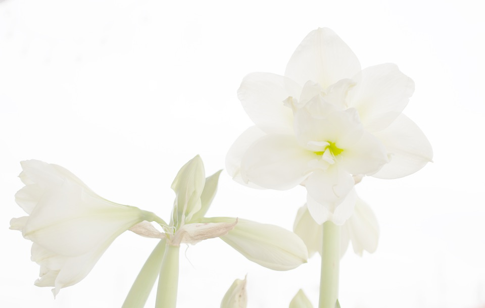

It is truly astonishing what phone cameras are capable these days, and that old saw about the best camera being the one you have with you is truer than ever. Nevertheless, I do sometimes get a hankering to go back to my “proper” camera. Sometimes it is because the picture couldn’t be taken any other way, like the [nesting blue tits](https://jeremycherfas.net/blog/they-came-back) I posted yesterday. Other times it is because I want a degree of control more than the phone affords me.

===

That’s the story with these two pictures of canna lilies, seized a couple of nights ago when the sky was on fire and I just wanted a little bit of fill flash.

[{.center}](canna2-large.jpg)

[{.center}](canna1-large.jpg)

Or this hemerocallis, which I wanted to shoot against the light, and then processed even further.

[{.center}](hemerocallis-large.jpg)

The phone would probably have done a first rate job on this iris, but I happened to have the camera in my hand.

[{.center}](iris-large.jpg)

Then there are images where I don't really want the phone to compensate for exposure, like these two.

[{.center}](pines-large.jpg)

[{.center}](acer-large.jpg)

The biggest problem with the camera is that there seems to be some kind of optical blemish, only noticeable when it falls in a very plain area, like sky, and much worse when the aperture is stopped down. I think it is the lens, rather than the mirror, but I haven’t tested extensively with different lenses. I should do that, because I cannot actually see anything on either the front or the back of the lens. Mind you, if it is the mirror, I have no idea how to go about cleaning that without the possibility of doing real damage.

Of course the other huge benefit of the phone is that it makes publishing photos so very easy. There is a way to hook the camera up to the phone using wifi and share from the phone, but the software is so hostile and flaky that I try to avoid it. In any case, that’s really no excuse.