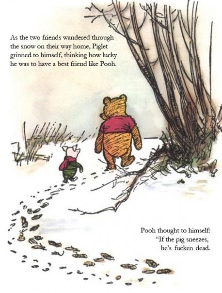

{.center}

Which makes you sicker? Swine flu and its [attendant brouhaha](http://archive.boston.com/bigpicture/2009/05/2009_swine_flu_outbreak.html)? Or the [monster operations that make swine ’flu the least of our worries](https://web.archive.org/web/20181028155040/http://www.ethicurean.com/2009/05/06/know-thy-enemy-smithfields-porky-expansion-into-eastern-europe/comment-page-1/#comment-119448/)?

!!! Photo stolen from John Gribbin, but it's going around. Like the ’flu. 
