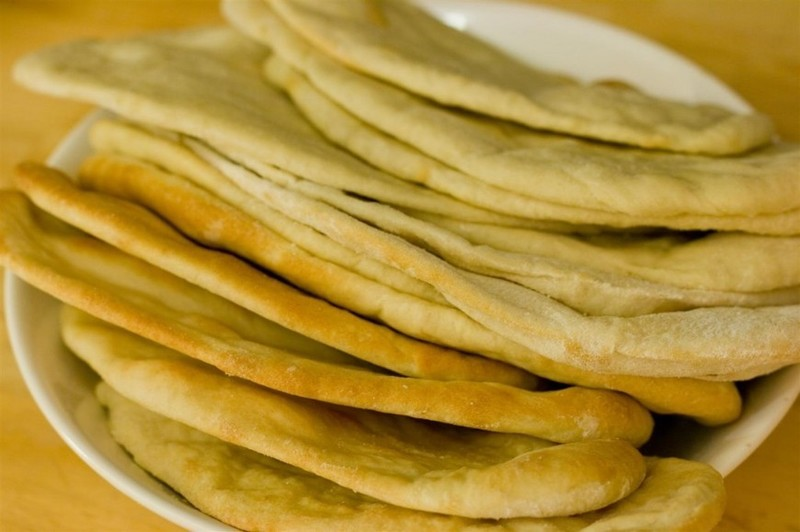

{.center}

> Every time I see pita bread for sale in stores these days I chuckle to myself. €1.40 for ~5 is a typical price around here. This recipe will make four times that quantity, for a third of the cost, and what's even better is that, as with all ...

Price alone is seldom enough of a reason for making your own breads, because it is always cheaper. I haven’t tried this recipe -- what would I do with 20 pitas anyway? -- but at least I know I have it if I ever do want home-made pita.

Original article: [Pita Bread | Five Euro Food](https://homesweetsweden.com/pita-bread/)
