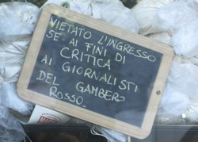
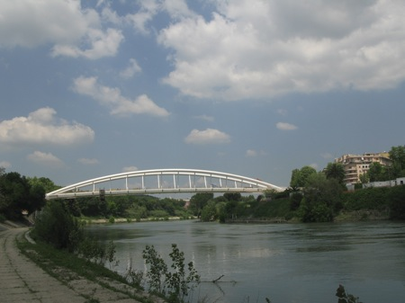
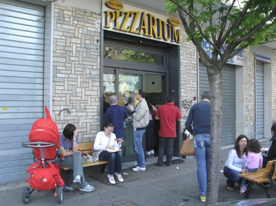
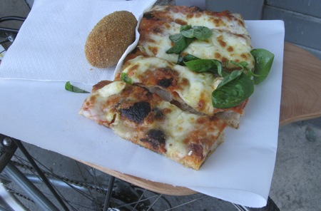

{.left} A glorious day. A bike ride beckoned, and as ever I need a goal. People rave about Pizzarium’s pizza as if it were manna from heaven, and it’s far enough away to give me the idea that I might even deserve the slice when I got there. So off I went, detouring via Piazza San Cosimato for supplies of the most astonishingly good giant golden sultanas, and down onto the cycle path along the side of the river. That was lovely in the sunshine. There were ducklings, and scullers, and other cyclists, and people strolling. It was so lovely, in fact, that when I got to the steps where I planned to ascend and head up to Pizzarium, feeling neither hungry nor virtuous enough, I decided instead to carry on for a while.

{.center}

To the end of the line, in fact, where below a shiny modern bridge an antique pile of flotsam and a rusty piece of reinforcing mesh barred the path. I turned around, and made my buttock-bruising way back, over concrete incised with deep grooves that I am sure were designed deliberately to impede progress. The steps up by Castel Sant’Angelo, unlike the ones by Ponte Garibaldi, do not have a nice little gutter to wheel the bike in. So I had to heave it on my shoulder. Hey ho, virtue in spades.

Having negotiated the hordes clustering around the Vatican I was somewhat peeved to have missed my turning, and found myself struggling up the giant hill behind the pope’s gardens. Eventually I found a tiny set of steep stairs down which the bike and I rattled. No virtue in that. And after a few more minutes there we were.

{.center}

It isn’t the most prepossessing place, nor does it need to be; the crowd outside tells you you’ve arrived. Inside, even at 2:30, was a scrum. You gently and patiently elbow your way to the front -- there’s no line, obviously -- to be confronted by a stunning display of laden pizza. Make your choice, get your ticket, gently and patiently elbow your way back to the till, and pay. Then it is time to gently and patiently elbow your way back to the front, although this time waving the ticket parts the waters, and pick up your order, by this time reheated, if that’s what you wanted. Back through the scrum to the pavement, all the while trying to keep a _suppli_ from rolling off the trencher.

{.center}

I chose _margherita_, just out of the oven to avoid any benefits or drawbacks of reheating. And it was good. More specifically, the base, for which Pizzarium is known, was indeed very good; full of nice big holes and light despite its height. The topping was also good, but (and I know this is going to sound heretical) there was just too much of it. Indeed, looking at all the various combos on display, most of them seemed overburdened. I’m not saying pizza toppings should be mean. Rather that there is a right amount, which is not too messy and which sits well with, rather than suppressing, the base. So that’s my verdict. Good, but not great.

Would I go there again? Not deliberately, although if someone wanted to I’d go with. Maybe driving home from the country, although it is on the wrong side of the main road in. Is it manna from heaven? Not in my view. I can get slices of similarly long-fermented pizza base and delicious toppings from a world-beating _pizzaiolo_ just a longish walk from here. And for a more standard thinner slice, there’s a place not too far away that I could tell you about, but I’d have to kill you. For sit-down, the local joint, Da Bruno a Quattro Venti (which I refuse to link to because its website autoplays a fatuous commentary) is way better than average. But for my money, when I want toppings to die for and a whole different attitude to the pizza experience, there's only one place: La Fucina.

!!! 2022-05-07: La Fucina has been joined by a handful of other exemplary joints. See me for details.
