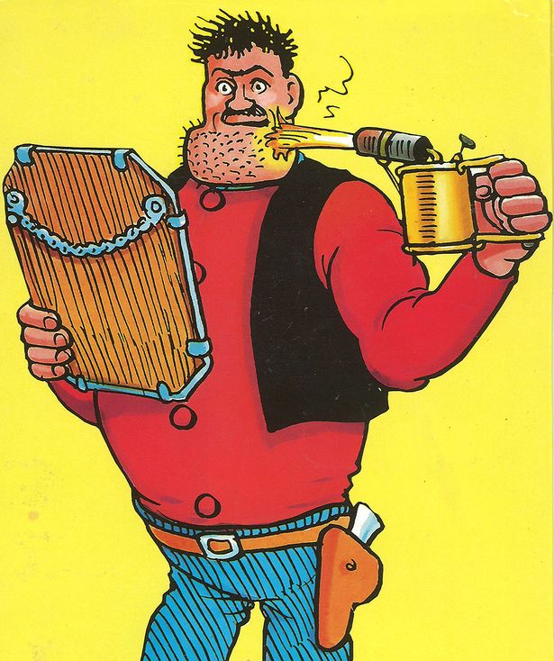

For about fifty years, I have been labouring under a personal grooming misunderstanding. It has always been my belief that one needs some sort of lubricant to get a decent shave; soap of some form, for the most part, although I did dabble with a shave oil for a month or two. A couple of days ago, for reasons,[^1] I decided to shave with just water.

Revelation.

===

It is entirely possible to get a pretty good shave with nothing but water. The biggest difficulty is to know where you've been and where you haven't been, which is much easier to see if you're lathered up. (That was a drawback with the oil, too.)

{.center} 

Once upon a time, when I restarted shaving with a double-edged blade, I even went so far as to join a dedicated bulletin board, and I have a dim recollection of people there swearing that a shave with plain water alone would, once you get used to it, be superior in all respects. Going back to look, I find advocates of cold water, rather than hot, but not much talk of no soap. In fact, lots more talk about lathering and superlathers and all sorts of bother, with all sorts of science apparently behind it.

I dunno. I've tried a soapless shave twice now, and it feels alright. Better than alright. Admittedly my beard is not in the Desperate Dan league, but I might try this a little longer, before I succumb and buy more shaving soap.

[^1]: Something weird happens when I get close to the bottom of my bowl of Proraso Green. It just stops lathering up. For a while I thought that might be because the blob of soap was no longer attached to the bowl and so was spinning freely under the brush. But then I held it down with my finger and still failed to get any decent lather. Is it possible that there is some sort of density effect, whereby what is left in the soap after a long while are heavier molecules that don't lather as much? I somehow doubt it. And I'm not sure what, if anything, to do about it? I could continue to shave without lather. I could buy a new bowl and spatula the remainder over. I could just chuck the remainder away. This is not some fancy-pants gentleman's grooming necessity; it's cheap and it works, mostly. We shall see.