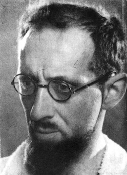

Sometimes the Internet turns me into a spoiled child, drumming my heels on the floor and holding my breathe till I turn blue in the face, and all because it won’t give me what I want. And of course it is all the Internet’s fault. If it hadn’t indulged so many of my whims for so long, I wouldn’t find this rejection nearly as painful.

{.right} The story isn’t too complicated. I’d been editing a [podcast on the superior nutritional qualities of the potato](https://www.eatthispodcast.com/potato/), which features people who have lived almost exclusively on a diet of potatoes and been none the worse for that. I vaguely remembered a story from my undergraduate days of a chap called Geoffrey Pyke, a canonical British boffin. Pyke, in my recollection, had developed a hare-brained scheme, one of many, to get the trains moving after World War II. It involved human-powered locomotives, the humans concerned being themselves powered by potatoes, and Pyke had done all the necessary calculations to prove the feasibility, if not the practicality, of the idea.

When I went searching for details, [Wikipedia](https://en.wikipedia.org/wiki/Geoffrey_Pyke) confirmed only part of the story:

> One suggestion for the problems of energy-starved post-war Europe was to propel railway wagons by human muscle power – employing 20 to 30 men on bicycle-like mechanisms to pedal a cyclo-tractor. Pyke reasoned that the energy in a pound of sugar cost about the same as an equivalent energy in the form of coal and that while Europe had plenty of sugar and unemployed people, there was a shortage of coal and oil. He recognised that such a use of human muscle power was in some ways distasteful, but he could not see that the logic of arguments about calories and coal were unlikely to be sufficiently persuasive.

Sugar? Well that would be pointless, nutritionally. It might be OK for energy, but what about all the other nutrients the cyclists would need? Of course Wikipedia had citations up the wazoo to support its far-fetched statements: three consecutive articles from *The (Manchester) Guardian* in August 1945. So that’s what I went looking for. Could I find them? Obviously not.

There are of course newspaper archives, which may well have contained those articles. But they required quite a hefty subscription, and there didn’t seem to be any way I could search without signing up first. Not that I want things for free, but if ever there were a need for a friction-free system of micro-payments, this is it. I’d happily pay a very small amount, say 5 cents, to discover whether the archive held what I was looking for and a slightly larger amount, say 50 cents, for a copy thereof. And my guess is that the archive might well earn more in total if it offered this kind of access. In the old days, living as I did in London, I would have been able to go either to The Guardian itself or to the national newspaper archive in Colindale, and on balance, I probably would not have done either. These days, spoiled child that I am, I drummed my heels and held my breathe. And wrote this.

##The Internet redeems itself

Still researching potatoes, I set off down another path, that of my old chum Colin Tudge, who despite being normally a thorough-going Cobbettian, has consistently praised the nutritional virtues of the potato. That led, in short order, to a throw-away remark (in [*So Shall We Reap*](http://www.amazon.co.uk/So-Shall-We-Reap-Worlds/dp/0141009500)) about “an heroic Danish physiologist” who had lived for a year on nothing but potatoes. And that took me to [Mikkel Hindhede](http://en.wikipedia.org/wiki/Mikkel_Hindhede) and his extraordinary account of the effects of the World War I North Atlantic blockade on mortality in Denmark. Thanks to Hindhede’s enlightened nutritional policy, mortality was far lower in Denmark than in Germany. Was Hindhede himself Tudge’s unnamed Danish physiologist? That I couldn’t discover, although I did discover that Frederik Madsen — originally a patient and later a janitor and assistant -- was persuaded to live on nothing but potatoes and a little fat, and thrived on the diet, even when encouraged to take on a farm job in order specifically to increase his need for calories. There were [others too](http://www.jbc.org/content/30/2/201.full.pdf). Hindhede himself ate nothing but potatoes and margarine for 27 days, and in the grand tradition of experimentally-minded physicians, he [involved his family too](http://books.google.it/books?id=PKKURClINjoC&lpg=PA45&vq=madsen&hl=it&pg=PA42#v=onepage&q&f=false):

> “We adults, as well as children, eat a great quantity of potatoes not only at dinner, but also at supper. In the evening, if there be no potato salad or potatoes served in some way on the table, we are sure to hear of the children present, ‘Are there no potatoes?’.”

Clearly they’re not spoiled. And there really doesn’t seem to be much wrong with a diet in which most of the energy comes from potatoes, as long as they’re not fried, which is more than you can say of most staples.

From all of which, I derive two important conclusions. The Internet giveth, and the Internet taketh away. And, eat more potatoes.
