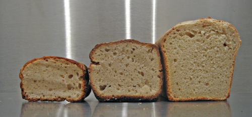

The blog has taken a back seat of late; we moved, we have no internets, we are tired, we have no time at work. But the whole chaotic jumble is beginning to sort itself out, witness the loaves:

[{.center}](sourdough-loaves.png)

===

I cannot actually remember when I first started to bake sourdough bread. I know that it was a long time ago. The Independent newspaper published a recipe which it then had to retract and correct. I took the correction as forgiveness for my lazy ways -- I had meant to try the original version -- and permission to just do it. I know it was before 1999, which is as far back as the Independent online seems to go. And I’ve been baking it, on and off, ever since.

We've been through it, my sourdough and me. I brought it to Italy, where it learned to cope with hard water and soft flour. I put it through the mortification of no-knead bread. I ignored it, breathed new life into it, had flings with other recipes and the pleasures of finding fresh yeast in every little supermarket. But I always come back.

This  time was no different. When the move was mostly over, the new oven installed and inspected, the kitchen worktop erected, I sought out the little plastic tub that had lain, guiltily uncared-for, in the back reaches of the fridge. I popped the lid and nearly fainted. Man but the bitch reeked. Almost enough to make me retch. That was one powerfully evil aroma. A less experienced, less dedicated, less committed, less biologically savvy individual would have thrown it away and asked her friend for a fresh starter.[^fn1] I held my nose, scraped off and flushed the dark brown goop that had puddled on the top of my beloved and set to.

The result was the loaf on the left. All but unacceptable, and inedible to anyone not fully committed. Three days later the mother still smelled pretty bad, but already the good germs were getting the upper hand. The result you see in the middle. Much lighter, but still heavy. And then, a week after that, the loaf on the right. Almost perfect. Devoured far too much of it last night with some fine minestrone. And again at lunch today.

All this matters for two reasons. First, for me, a home is nothing without home-baked bread. There’s no fancy accounting for it, no justifications, nothing. It just happens to be so. I now have a home again and I bake bread in it. Secondly, the whole business of sourdough is a lesson in life. The way the flour ecosystem adapts to the prevailing conditions, changing its composition and the outputs of the system as a whole, fascinates me. I’d like to really study it, and the influence of temperature, humidity, flour and all that. There’s not a lot of point, of course, because it has mostly been done and I could just [read it up](http://www.amazon.com/gp/redirect.html%3FASIN=1580088023%26tag=ws%26lcode=xm2%26cID=2025%26ccmID=165953%26location=/o/ASIN/1580088023%253FSubscriptionId=02ZH6J1W0649DTNS6002). I’ve also discovered, these past three loaves, that the working of dough is as important to me as the eating of the resulting loaf. I’ll go back to no-knead some time soon, but it will never really be my staple loaf.

[^fn1]: If you're reading this, you know who you are, and yes, you can have another starter.

! 2021-09-08: It’s funny, looking back on this and many other posts, how my baking has grown. These days, I certainly wouldn’t bake three loaves just to get the starter going again. I would just do three quick feeds in succession. I’m not nearly as keen on kneading either.
