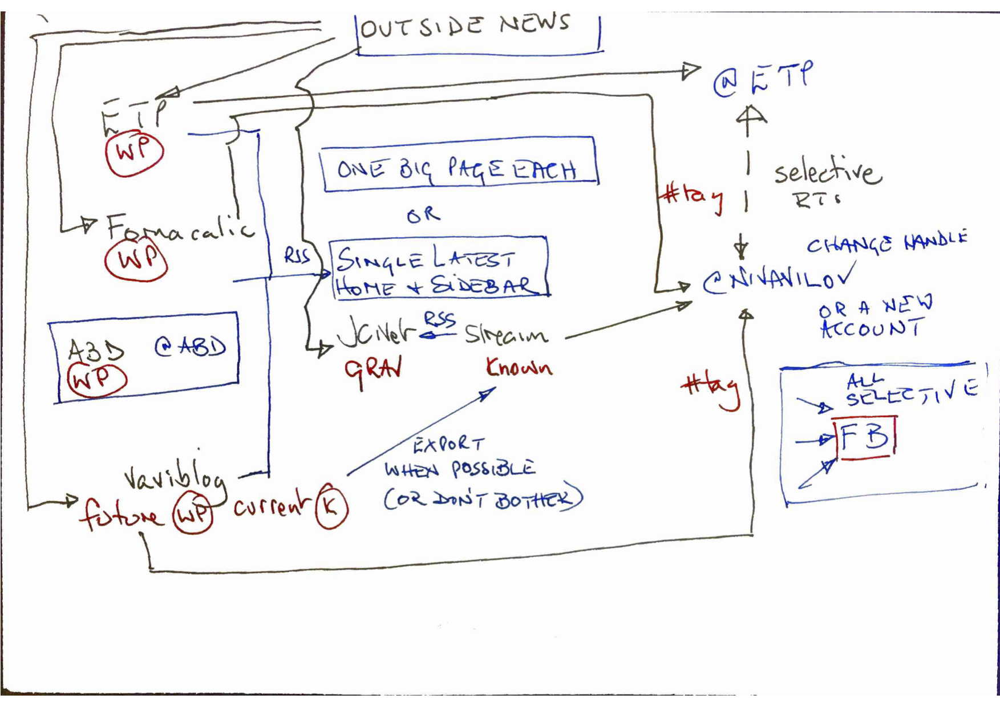

This past weekend, what with it being Easter and all, I decided I would attempt to go all in on [indiewebifying](http://indieweb.org) one of my WordPress properties. I downloaded all the plugins and all the additional plugins they told me to download and set all the settings and then retired whimpering with my tail between my legs to regroup.

===

##Taking stock

Over the past three months I've been trying to move forward based on [Putting my house in order: Phase 1](https://www.jeremycherfas.net/blog/putting-my-house-in-order-phase-1) 

The primary achievement, so far, is that as planned I managed to set up an instance of WithKnown on my own server at DreamHost as a subdomain of jeremycherfas.net, which pleases me no end. And with the help of a plugin, I can usually display the most recent posts from there to the sidebar of the Mothership's blog.[^1] Two itches remain. 

1. I think I want to export all the old stuff from vaviblog.com and bring it in, but that requires waiting for the public release of WithKnown -- which is all Vaviblog can use -- to support export in a format that the latest version -- which is what I am using on my server -- understands. Life may be too short. In any case, that really is some pretty ephemeral stuff. Maybe I'm better off without it.
2. I need a much deeper understanding of how WithKnown treats various kinds of information-sharing activity, because the results I get when [POSSEing](https://indieweb.org/POSSE) from my stream to social silos is often more than somewhat surprising.

I also managed to set up a page for book reviews and the like, which will I hope morph into a record of more of the things I've read, especially if they prompt notes. And my development version of Grav can now accept comments. I haven't made it public yet because it still needs a bit of tweaking to reject spam without inconveniencing readers and, eventually, to bring in backlinks delivered by Webmentions.

[^1]: This is still slightly flaky and temperamental, and I need to try and sort it out so that it doesn't display absolutely everything. 

I also fixed the [Fornacalia](http://www.fornacalia.com/) thing, so it goes there with and without the www and moved to a WordPress theme that is equipped with the under-the-hood niceties that permit me to be a good indieweb citizen.

##Moving on

And that new theme was one reason why I decided to go all in on indiewebifying that site, but I came up short when I realised I didn't know **why** I was doing that. 

It isn't as simple as owning my data. I already own the domain and the data. So, prompted by some acute questioning from my new-found friends in the [indieweb IRC channel](https://indieweb.org/IRC), I did some more thinking, which ended up with a diagram, of sorts.

{.center} 

This maps out what I really want from indiewebifying my various properties: to be able to extend their reach by sharing into other silos, most notably Twitter but perhaps also Facebook, and to foster engagement by repatriating any activity in those silos.[^2]

[^2]: Quite apart from just liking the idea of indieweb and wanting to support it.

In essence:

* Each site hosts new content germane to its identity.
* The satellite sites share automatically via RSS to the Mothership.
	* **Either** one big page for each satellite,
	* **Or** the single latest post from each on the home page and in the blog sidebar. *Slight preference for this option.*
* Outside news comes manually in to whichever site it suits best.
* Some of that outside news and new content gets shared **selectively** to silos.
	* From ETP to @eatpodcast.
	* From Mothership, ETP, Fornacalia and Vaviblog (when resurrected), possibly with a specific #tag, either to @nivavilov or to a compeletely new Twitter account. *I really don't want yet another Twitter account; pivoting the use of @nivavilov may annoy some of its current followers, but I can forewarn them, and I suspect they might be relieved.*
* Some selective sharing from all four sites to FB.

That's the outline, at any rate. And as the main point is to share, I'm vain enough to want the shared posts to look good. So that's my next big push, even before connecting all the plumbing lines on the diagram: to make sure that links to Twitter and FB look good.
