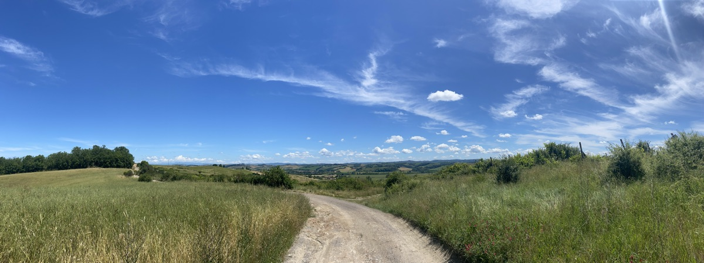

[Rabbit Quest](http://rabbit-rabbit.quest/) really is fun home and away, offering at least one option for somewhere to go. This morning, first of a few days in Tuscany accompanying The Squeeze, the quest was about 1.5km away and reasonably close to a road. Off I went.

----

Walking in this part of the world at this time of the year is always a treat. The roads and tracks are generally in good shape, it isn’t too hot, and the roadsides and fields are full of flowers. The topography is fascinating too, the way often opening up onto beautiful distant views and at other times enclosed by bushy margins. Ups and downs are frequent and generally manageable, which provides more entertainment.

<figure>

<figcaption style="font-style: italic;">One of many sweeping panoramas</figcaption>
</figure>

The [quest itself](https://stream.jeremycherfas.net/2024/rabbit_quest-geohashing-20240604-w-b1n8lg) was easy to reach, opposite a beautiful farmhouse _agriturismo_ — one of many littering the landscape — that was guarded by a very friendly little Jack Russell. I walked on a bit and into a field to get a view better than the bushes closest to the quest itself.

In the shade of a big oak near the quest I consulted Open Street Map and worked out that it would be easy enough to complete a circuit rather than double back, and not a lot further, so that is what I did. Along the way I stopped to snap some wildflowers and a sign that might mean something to some readers. It suggests that tomorrow’s excursion might be on the Brompton in the direction of Montalcino, although I am unlikely to manage the final ascent. 

<figure>

<figcaption style="font-style: italic;">A well-used signpost on the Eroica cycle route</figcaption>
</figure>
 
 ## Wildflowers along the way
 
<figure>

<figcaption style="font-style: italic;">Probably wild salsify</figcaption>
</figure>
 
<figure>

<figcaption style="font-style: italic;">Definitely red clover</figcaption>
</figure>
 
<figure>

<figcaption style="font-style: italic;">Pyramidal orchid, always a treat</figcaption>
</figure>

<figure>

<figcaption style="font-style: italic;">Rampion, <em>Campanula rapunculus</em></figcaption>
</figure>

