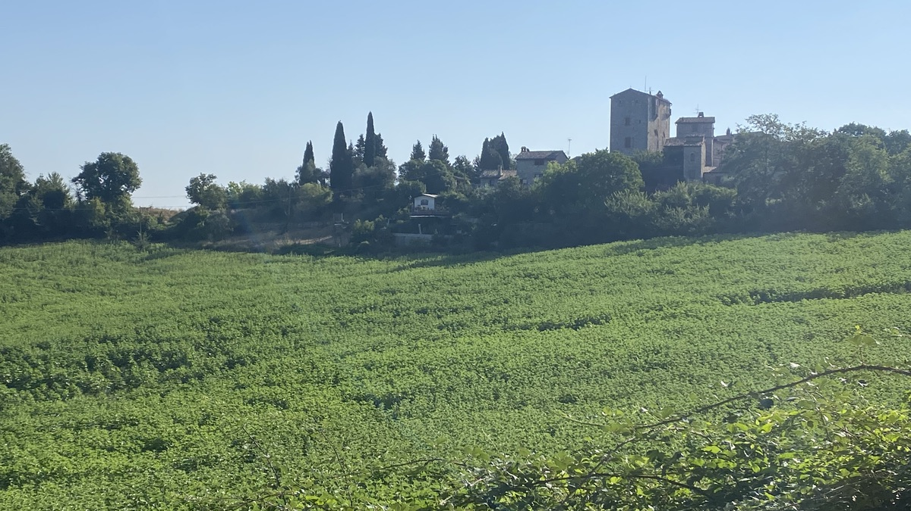
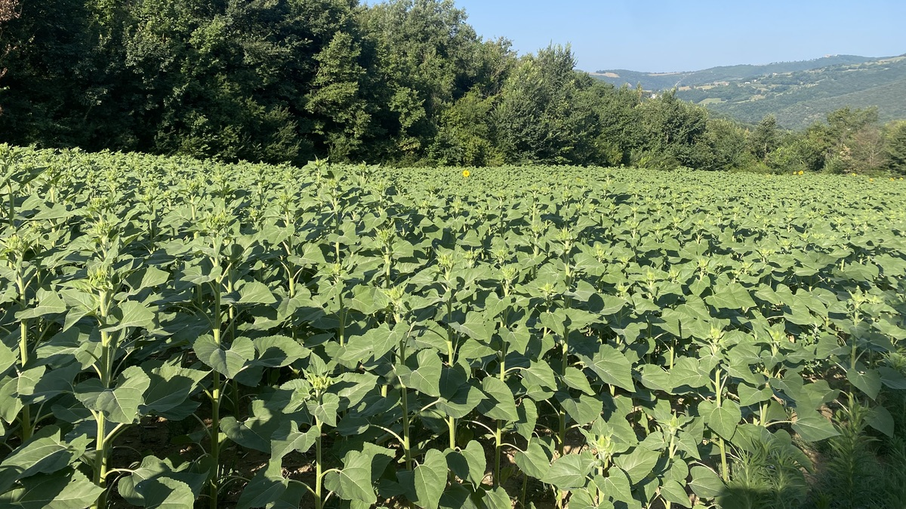
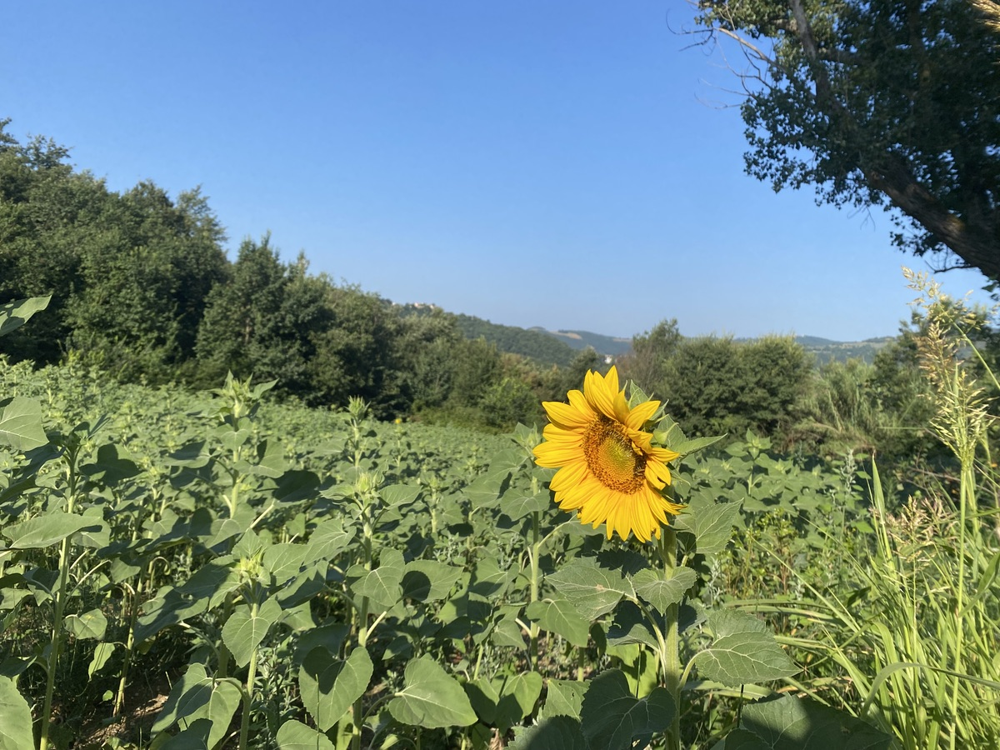
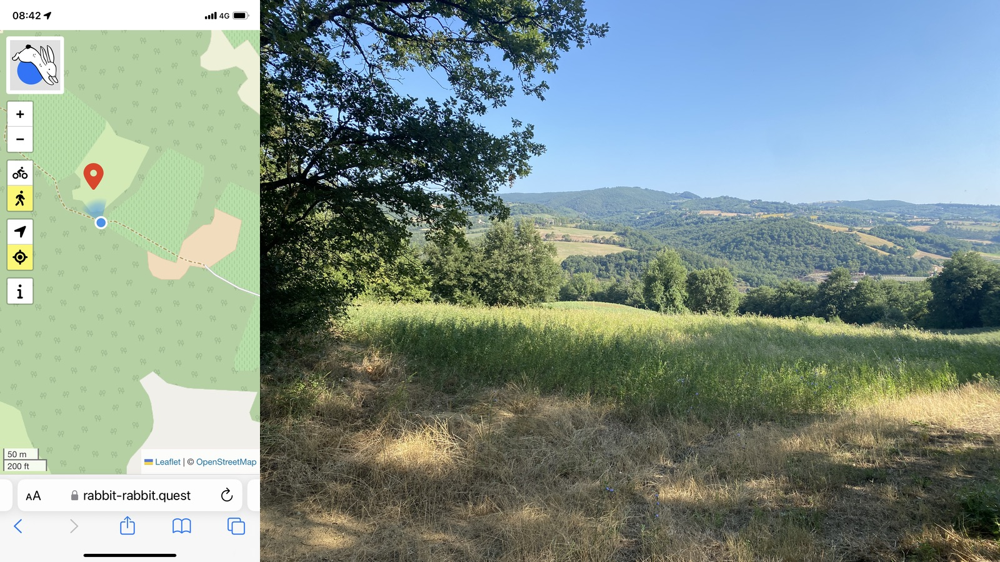
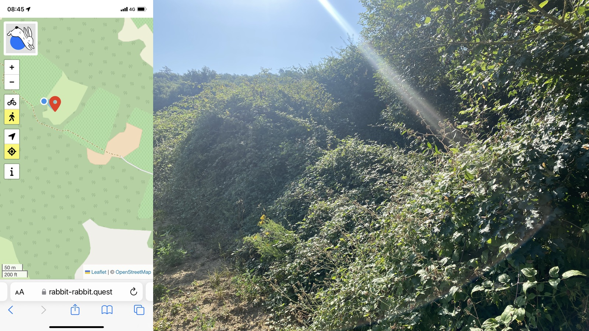

It is surprising how difficult it is to take a walk when you are on holiday at a remote spot in the countryside, especially if you prefer to loop rather than walk there and back. Footpaths are non-existent and signage inadequate so there’s no telling where you might end up, from which you will have to retrace your steps.

===

Of course, when you do find a good walk, it is far more pleasurable than anything the town has to offer, but even a regular circuit here can become repetitive. My habit of checking [Rabbit Quest](https://rabbit-rabbit.quest) each day can be depressing too, with the beckoning red pin mostly inaccessible. Today was different. I could see that it was not too far, about 3km, and near a marked track. I could also see, even without contour lines, that it would be quite a way downhill from here, but if I could get down, I could get back. So off I went, early to avoid the heat.

{.center}

{.center}

Getting there was easy. A bit of a scramble, at times, but not actually difficult. The way passed through woodlands pierced by hidden fields, mostly of already harvested wheat, not yet blooming sunflowers, or fallow. In each field of sunflowers there seemed to be one or two precocious plants that were ahead of the others, which made me wonder about the purity of the seeds, but let that be. Birds were tweeting; I don’t have Merlin, so cannot tell you what they were although The Squeeze, who does, says Eurasian Blackcap is always a good guess. Wildflowers were blooming, most notably some dense stands of teasels. And the bugs seemed mainly to be at bay. It was very pleasant.

{.center}

When I got close to the Rabbit I could see that there was no way to reach it, so I snapped the requisite evidence and took a closer look at the map. The path continued on down and eventually joined the road that snakes along the river. Better a longer walk back that was not so steep, I reasoned, and off I went. A little further on, the edge of a sunflower field let me get slightly closer, so for the first time I kind of triangulated the Rabbit.

The way back was long, and though it was steep at times, it was considerably less steep than the climb down. Roughly two hours and nine km after I set out I was back and ready for a cool shower.

