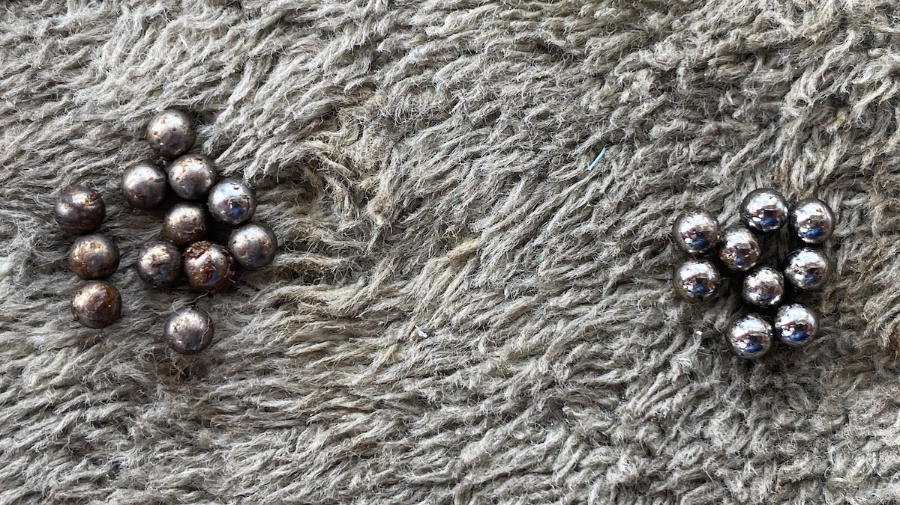
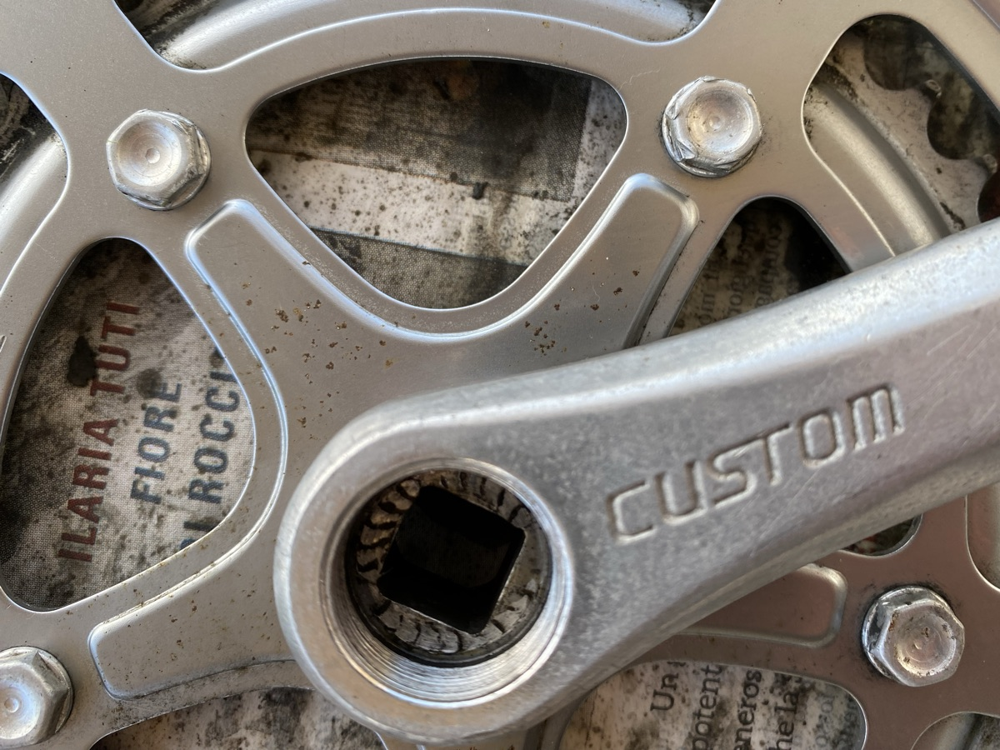

Restoration of the old Raleigh is starting to pick up a bit of speed. I had to pay money to get the stem and bottom bracket removed by a professional with a blow torch and an angle grinder, but the frame is now ready to be rubbed down and touched up (Oo-er, Missus!) There have also been a couple of interesting discoveries.

===

Like, one crank is 170mm and the other is 165mm. Now, I cannot exactly recall any of the repairs and mods that were carried out on the bike, but at some point I must have needed a new crank and at that point I was more likely to pay and be done with it than derive any satisfaction from doing it myself. The miracle is that I had absolutely no idea, and yet when I mentioned it online, everyone chimed in to say that my body will thank me for evening them up. So, I’m currently waiting on a nice aluminium 165 mm crank on eBay. Or maybe I’ll just go and see if the raggle-taggle bike menders have one.

I know they won’t have the saddle I want, and the old one remains perfectly serviceable, so that’s another eBay lurk.

Like, one pedal was perfectly and symmetrically equipped with 13 little ball bearings on each end of its axle, while the other (the one on the mismatched crank, as it happens) had 12 at the crank end and 9 at the far end. I mean, really?

{.center}

Again, though, as I had not actually noticed anything previously, I reassembled with what I had, rather than hold things up while I source replacements. Those replacements will also need to include replacement seals, if such things can be obtained, because one was split. Still, it should keep out most of the water and grunge as is.

Like, the hexagonal shaped things on the chainwheels are not, in fact, bolt heads. They are rivets, made to look like bold heads. Further cleanup is going to take what one expert wisely described as “flossing with a rag”. All in due course.

{.center}

All in all, though, I am really enjoying myself. If I have a decent ride at the end of it, that will be a bonus.