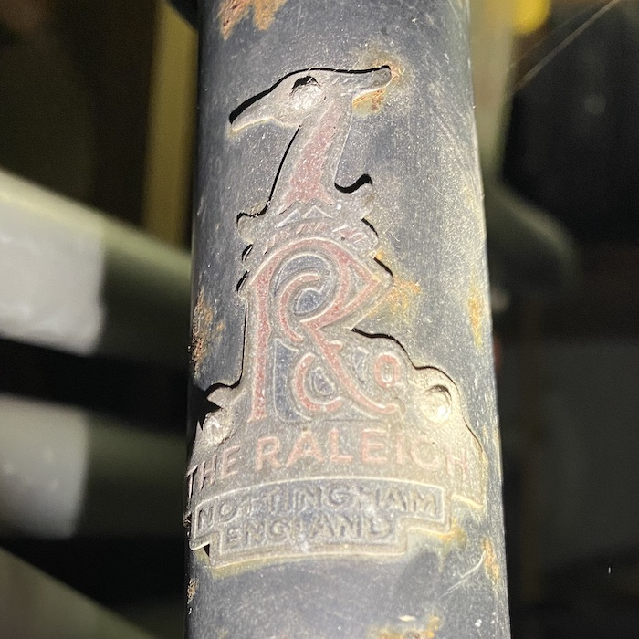
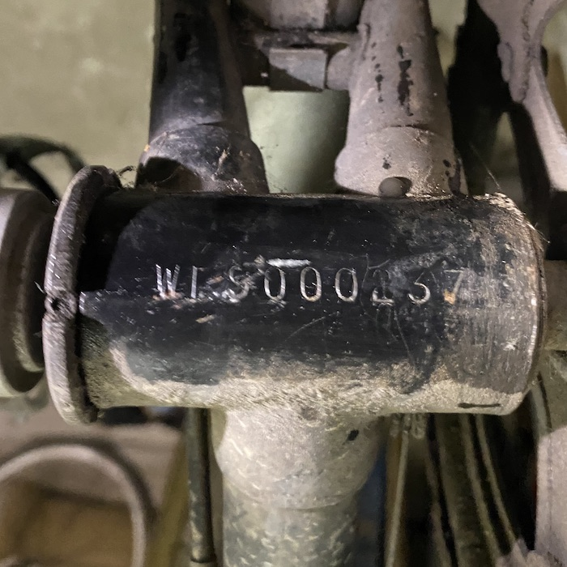
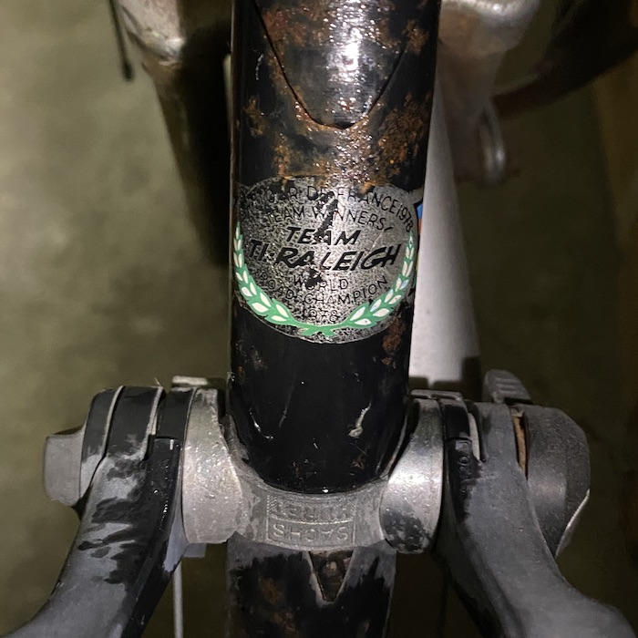
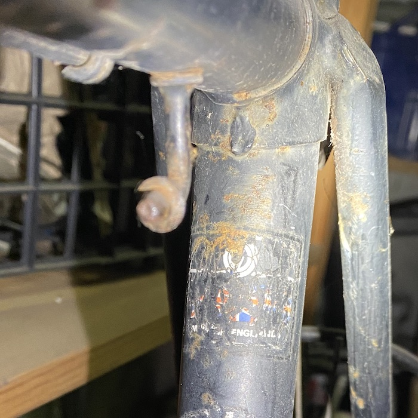

! Couldn’t avoid the title, even though I know Re-use has higher priority than Re-cycle. 

Over the past month or so I have been drawn inexorably into the world of unracer cycling, all of which has prompted both a forehead smacking *but-I’ve-always-done-that* and a guilty *why-is-my-best-bike-languishing-unloved*. With the purchase of a bike repair stand to help with the other bike, I was seized with the idea of fixing up the road bike. I mean, how hard can it be?

===

Several YouTubes later, I know how hard it can be, and also that I don’t actually have to go so far as to buy an ultrasound cleaner (although there are some temptingly cheap models around). I reckon fixing the bearings on the headset and bottom backet, sprucing up the gear shifters and derailleurs and new cables for them and the brakes will do the trick. A good general clean too, and something for the rust spots, though not a complete respray, to finish it off. That truly will not be hard, though it will take a long time.

Step one in the whole process is to identify my bike. I can’t remember when I bought it (though I do remember where). After a lot of online searching (thank you, [Raleigh nerds](https://www.sheldonbrown.com/) everywhere), this picture of the serial number under the bottom bracket tells me it was made in Worksop in the ninth fortnight (really) of 1979. That seems about right.

A decal on the down tube sort of confirms the date, as it boasts of a team win in the 1978 Tour De France. I also noticed, from the photo, that the shifters are (upside down) Sachs-Huret, which I think were fitted at some point when I learned about index shifters, but I really cannot be sure.

The frame is all steel, lugged, though I have no idea what kind of tubing (nor do I care). This decal might once have told me, although I cannot now decipher it.

That also shows an interesting potential clue to greater specificity: the lug on the cross tube that once held the pump. A close look at some of the [exploded drawings and parts lists](https://www.sheldonbrown.com/retroraleighs/catalogs/1977-drawings/index.html) suggests that it could be a Record 26-DL129 or a Record DL30 or a Grand Prix DL115, all of which have safety levers on the brakes, but according to those parts lists, none were made with a black frame. Also, my frame measures 26"; I am relatively tall. So maybe it was some kind of one-off or special order. I honestly do not remember.

In any case, I’m determined to put it back on the road and I think my first step will be the bearings. I only hope I can disassemble the darned things.
