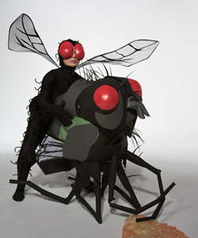

Step 1: Google "rossellini porno inspiration"

{.center}

Step 2: [Read](http://www.monstersandcritics.com/smallscreen/news/article_1403976.php/Isabella_Rossellini_makes_a_Porno_for_Sundance_channel) “Rossellini had interest creating a series of little films about how different bugs mate, and Robert Redford has continued in the theme of his eco-friendly programming for the channel.”

Step 3: Scratch confusedly.

Step 4: Read ~~http://www.demonoid.com/files/details/1477376/4651332/~~ [^1] “Inspired by the amazing and often bizarre sexual practices of insects and other creatures, these 8 films are both comical and insightful studies of the curious ways a variety of earth's tiny critters ‘make love’.”

[^1]: 2021-10-17: Excluded from the Wayback Machine.

Step 5: Begin to wonder about all-knowing power of interwebs.

Step 6: [Read teaser](https://web.archive.org/web/20100901165116/http://www.nerdcore.de/wp/2008/05/07/green-porno-star-isabella-rossellini-takes-on-insect-sex/): “So, how did the glamour icon get into the insect porn business?”

Step 7: Pursue tease to [source of lifted prose](https://www.wired.com/2008/05/green-porno-sta/).

Step 8: Drink deeply from Wired source:

> I’ve always been very interested in animals, so I knew that insects had these very odd ways of mating and I thought, “Oh, it’d be great to do a series of little films about how different bugs mate.”

> I’ve kept my nature books and always made little notes about these mind-blowing things insects do, and I also called friends who were scientists. The information in Green Porno is correct, but the way we sell it is absurd.

> The hardest part was to translate all this information into a few simple strokes: “If I were a fly I’d have these eyes, I’d have this, I’d have that” -- boom boom boom -- so that people say, “Yeah, she’s a fly.”

**Wired**: How much was the budget? 

**Rossellini**: $70,000 for the whole series. $7,000 or $8,000 for each film.

Question 1: Is $4000 a minute more or less than an average _Homo_ porno?

Step 9: While pondering, pursue the YouTube video that is no longer available from the Wired page and [watch it](https://www.youtube.com/watch?v=fs6zXf7qqJY).

OK, that explains everything.

Question 2: Can we be absolutely sure [Dr Tatiana](https://en.wikipedia.org/wiki/Olivia_Judson) was not involved?
