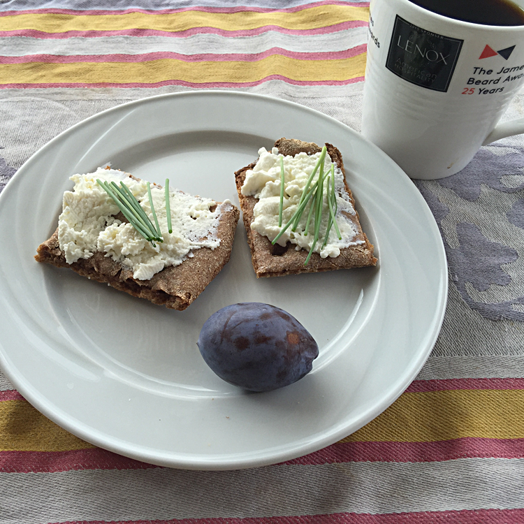

I was in Stockholm for the first time a week or so ago, attending a huge meeting to record material for [a client's podcast](http://wle.cgiar.org/thrive/podcast). That went well enough, but the truly nice thing was what a wonderful, liveable place Stockhom seems to be. Admittedly we enjoyed better weather than they've had for months, but one thing really struck me was the huge diversity of crispbreads, from the very traditional round ones, still with a hole in the middle so you can thread them on a pole for winter storage, to utterly modern things studded with chia seeds. I love them all. 

{.center} 

Back home, I had to try and make my own. I wrote up [the first effort](http://www.fornacalia.com/2015/cracking-rye-crackers/) (second really), even though the results were not all that great, and I am determined to keep trying.