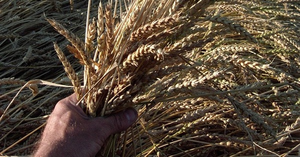

{.center}

For more than 40 years, one wheat variety dominated the Canadian prairies. Red Fife — the red-seeded wheat grown by David Fife, a Scottish immigrant — gave the highest yields of the best quality. It almost didn’t happen, if you believe the stories. And then, having set the standard, Red Fife was eclipsed by its own offspring and slowly slid into oblivion. Until, in 1986, Sharon Rempel set about rescuing it.

<a href="https://www.eatthispodcast.com/our-daily-bread-09/" rel=canonical>Listen to Red Fife at Eat This Podcast.</a>
