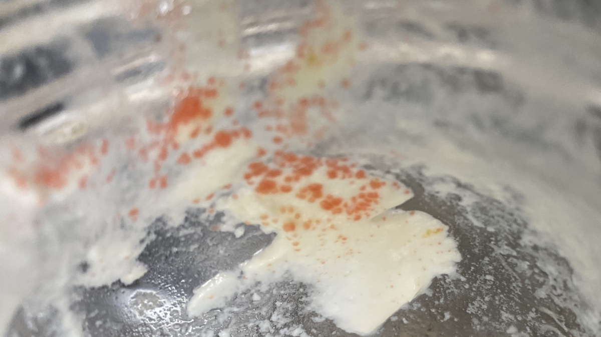

Priority task after coming home from a long spell away is always to take care of my microbial friends. The 100% hydration bread starter came back to life just fine. The kefir will have to wait till tomorrow and the 75% hydration wholemeal a little longer still. The yoghurt I did yesterday, and was greeted with a sight I'd never seen before.

{.center}

Those orange-red dots were growing on some of the yoghurt that had become stranded at the top of the jar, which had been sitting in the fridge for a little more than a month. I think they must be _Sporendonema casei_, the most common red mould on cheeses. It doesn't seem to be in the least bit harmful, and may [well be desirable](https://www.janetfletcher.com/blog/2018/11/3/kissed-by-mold). In any case, I avoided it while inoculating the new batch, which turned out just fine.
