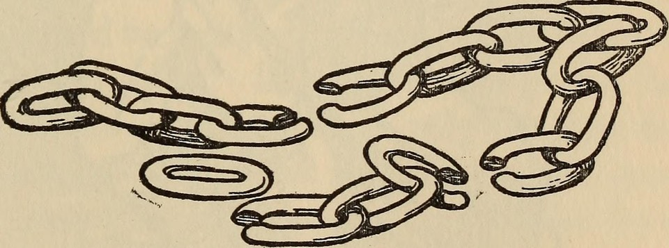

I was a little surprised when a link to a recent (December 2020), eminently citable blog post led me straight to [the Wayback Machine](https://web.archive.org/web/20210221014158/https://ideopunk.com/2020/12/22/100-tips-for-a-better-life/). I did a little searching, and easily found [the current version](https://ideopunk.com/blog/tipsforabetterlife). What seems to have happened is that the author changed their publishing system (I can see the changed URL and that they moved away from WordPress) without bothering to redirect existing links. And from what I can tell, it would be relatively straightforward to fix. I mean, even I managed it.

{.center}

As I have continued to bring in older posts on a daily basis, I have been struck by how often even large companies let old links perish, when it wouldn't take much to at least redirect to a version that works. I have also been pleasantly surprised by how many people who have personal websites have maintained their sites and their links. No firm numbers, of course, just an impression, but a good one.
