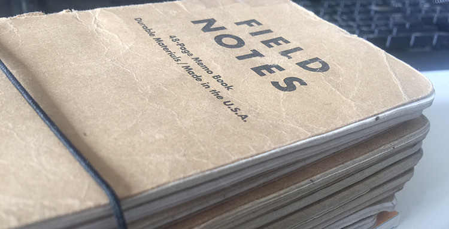

 {.center} 

My friend Jason observed, <a class="u-in-reply-to" href="https://matigo.ca/2018/02/25/writing-tools" >in a more general why-write-a-blog post</a >, that a stranger in a strange land often writes, daily even, about "about all the new and interesting things that caught his eye". Over time though, and so partly as a result of familiarity and partly as a result of other things being more urgent, that kind of writing stops.

As it happens, one of the old posts I was bringing over here this morning was the most recent of my [*Scenes from Roman life*](https://www.jeremycherfas.net/search/query:Scenes%20from%20Roman%20life). Most recent being from 2012. There was one post in each of 2012, 2011 and 2010, three in 2009, six in 2008, three in 2007 (anomaly alert) and eight in 2006, perfectly illustrating Jason's point.

I changed tack and decided to bring a few of those in, and discovered as I did so that like almost all my writing here, these posts are essentially an outboard memory. My inboard memory is terrible. So I write things down. In my notebooks, digitally with a pen, and here, digitally with a keyboard. I suppose it's no surprise that my favoured constant carry notebooks are [Field Notes](https://fieldnotesbrand.com) brand. Their motto:

> I'm not writing it down to remember it later, I'm writing it down to remember it now.

Except that I am also very much writing it down to remember later, which is where searchability wins. And if I want to remember things about more recent Roman life, I better get back on the wagon.